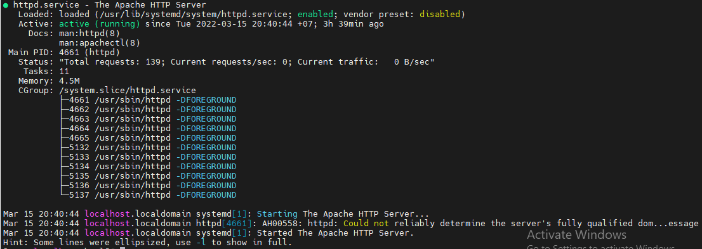
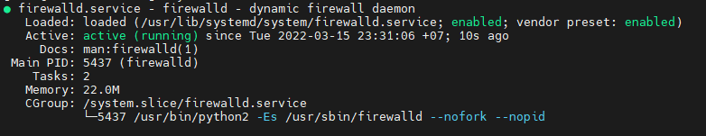
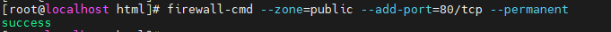
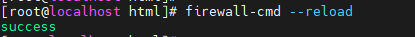
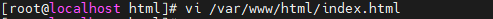
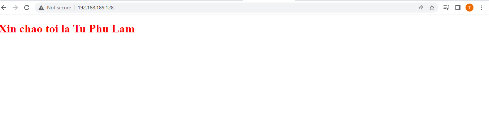
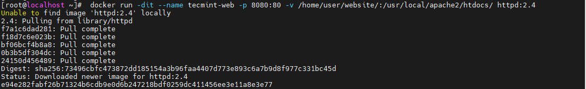
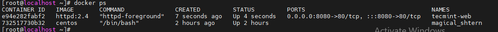
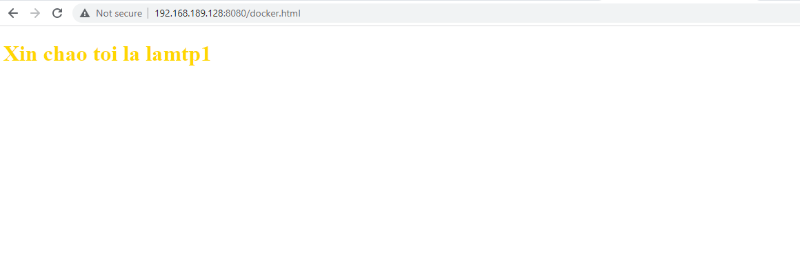

<h1 style="color:gold">Cài Apache Service trên Centos7</h1>

## `B1:` Cài đặt Apache server bằng lệnh:

        # yum install -y httpd

Sau khi cài xong, thử kiểm tra trang thái của service bằng lệnh: 

        # systemctl status httpd

Nếu hiển thị kết quả như sau nghĩa là cài thành công:

## `B2`: Kiểm tra xem firewalld đã hoạt động chưa, nếu chưa thì kích hoạt.

        # systemctl status firewalld

        # systemctl start firewalld

## `B3:` Dùng lệnh để mở port 80 trên firewall sử dụng giao thức TCP:

        # firewall-cmd --add-port=80/tcp --permanent

Nếu có dòng success như trên nghĩa là ok!

## `B4:` Reload lại firewalld dùng lệnh:

        # firewall--cmd --reload

Nếu hiện dòng sucess như ở trên thì ok

## `B5:` Dùng vi để chỉnh sửa file HTML ở đường dẫn /var/www/html

        vi /var/www/html/index.html

sau đó paste đoạn sau vào:

        <!DOCTYPE html>
        <html lang="en">
        <head>
            <meta charset="UTF-8">
            <title>Test thu apache server</title>
        </head>
        <body>
            <h1>Xin chao Toi la Tu Phu Lam</h1>   
        </body>
        </html>

## `B6:` Vào trình duyệt, nhập IP của máy, ở đây là: 192.168.189.128, nếu hiện thế này là ổn!

<h1 style="color:gold"><b>Hướng dẫn cài Apache container</h1></b>

Trước hết, chúng ta cần có Docker sẵn trên máy, bước này đã được hướng dẫn ở file "02.docker-install" ở mục Docker.

Ở ví dụ này, ta sẽ khởi tạo một `Apache 2.4` container có tên là `tecmint-web`, ta sẽ dùng một image tên là `httpd:2.4` từ `Docker Hub`

Mục tiêu của ta là chuyển các requests gửi đến public IP ở port 8080 chuyển hướng đến port 80 trên container. 

>Ở trong container, ta dùng port 80 và ta forwarding port này đến port 8080 của máy host

Và ta sẽ vẫn hành trang web ở /home/user/website thay vì ở /usr/local/apache2/htdocs trên container bằng phương pháp `mapping`

`mapping` ở đây nghĩa là: 
>Memory mapping is the translation between the logical address space and the physical memory. The objectives of memory mapping are 

>(1) to translate from logical to physical address, 

>(2) to aid in memory protection (q.v.), and 

>(3) to enable better management of memory resources.

Dùng lệnh: 

        # sudo docker run -dit --name tecmint-web -p 8080:80 -v /home/user/website/:/usr/local/apache2/htdocs/ httpd:2.4

Để pull image `httpd:2.4` và chạy ở TCP port 80 của container, sau đó forward ra port 8080 của máy host (-p 8080:80) 

Dùng lệnh:

        # docker ps

để kiểm tra xem image đã down về chưa:

Sau đó dùng lệnh:

        # vi /home/user/website/docker.html

để chỉnh sửa file html

sau đó nhập Server-IP:8080/docker.html để xem trang html bạn vừa sửa: 

Kết quả thế này là ok.
