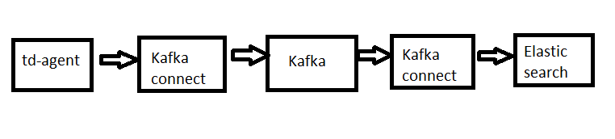

<h1 style="color:gold">Các lưu ý về Kafka</h1>

1. Kafka chạy trên môi trường Java, hiện tại là trên `java 1.8.0`
2. `Kafka connect` giữa `td-agent` và Kafka gọi là Producer (đảm nhận việc gửi record đến các Broker) `Kafka connect` thứ 2 nối giữa Kafka và `Elasticsearch` gọi là `Consumer`.

