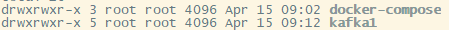
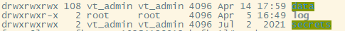
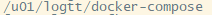
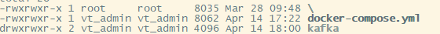
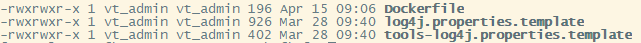
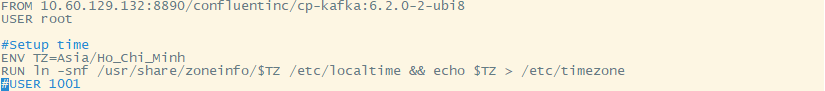
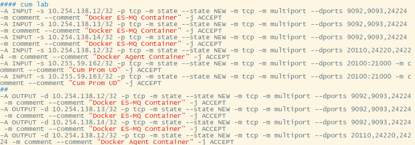

- Bước 1: tạo thư mục tên `kafka1` và `docker-compose` với các quyền như sau ở đường dẫn: /`u01/logtt`:

- Bước 2: tạo các thư mục con bên trong thư mục kafka1 vừa tạo ở đường dẫn `u01/logtt/kafka1` với các quyền như hình dưới:

        
      

- Bước 3: tạo thư mục tên là `kafka1` ở đường dẫn:

- Bước 4: tạo các file trong thư mục `kafka1` vừa tạo với đầy đủ các quyền như sau:

- Bước 5: copy 2 file sau (log4j và tools.log4j) ở `HD tích hợp Kafka` và thêm quyền như hình dưới ở đường dẫn `/u01/logtt/docker-compose/kafka1/kafka`:

- tạo `Dockerfile` với nội dung như sau cũng ở cùng đường dẫn với 2 file trên:

- Bước 6: Config như ở trong file `PHỤ LỤC ` ở thư mục `HD tích hợp` với file `docker-compose.yml`. Chú ý phần `KAFKA_BOOTSTRAP_SERVERS` phải thêm IP và port server của mình để tạo cluster.

- Bước 7: Sửa iptables ở phần ` #### cum lab` thêm các port ở cả input lẫn output sau đó restart. 

- Bước 8: chạy lệnh:

        docker-compose up -d --build 

để tạo Kafka container.

- Bước 9: Nhập:

        docker ps

để kiểm tra Container kafka vừa tạo.