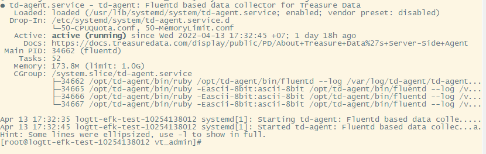
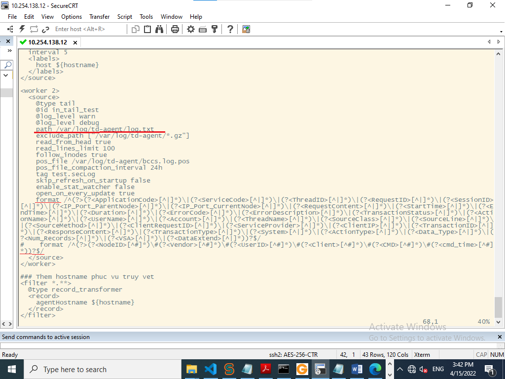
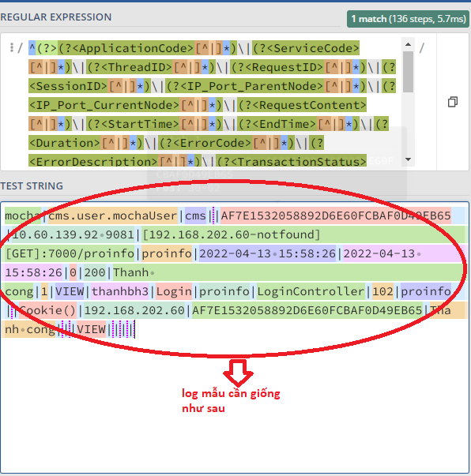
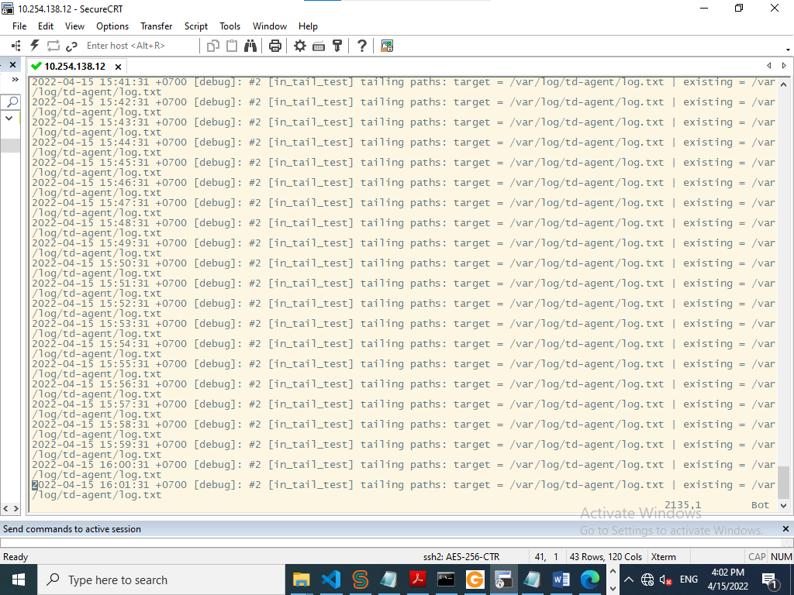

<h1 style="color:gold"> Hướng dẫn tích hợp td-agent dạng service </h1>

Cài đặt như phần ` Hướng dẫn tích hợp td-agent` trong thư mục ` hướng dẫn tích hợp` ,hoàn thành 3 bước trên, nếu dùng lệnh `"systemctl start td-agent"` mà không start được thì dùng lệnh:

        td-agent-gem list | grep 2.0

để xem có plugin `fluent-promethues-plugin (2.0.1)` không, nếu có thì dùng lệnh

        td-agent-gem uninstall fluent-prometheus-plugin

chọn phiên bản muốn xóa - là bản 2.0.1.

Sau đó, khởi động lại td-agent dùng lệnh `systemctl restart` rồi enable và start lại td-agent.

Kết quả:

- Thay đổi format log ở file `/etc/td-agent/td-agent.conf`

- Copy format này và vào trang regex101.com để tạo ra log mẫu lưu vào file text nào đó để test. Chú ý cần thay đổi đường dẫn file log sẽ được đẩy lên ở file `td-agent.conf`, ví dụ: `path /var/log/td-agent/log.txt`
Log mẫu sẽ có dạng như sau:

- Sau đó, thực hiện `systemctl restart/enable/start td-agent` để file cấu hình được nhận.

Nếu thực hiện thành công thì kết quả sẽ như sau khi vim vào file `td-agent.log`:

