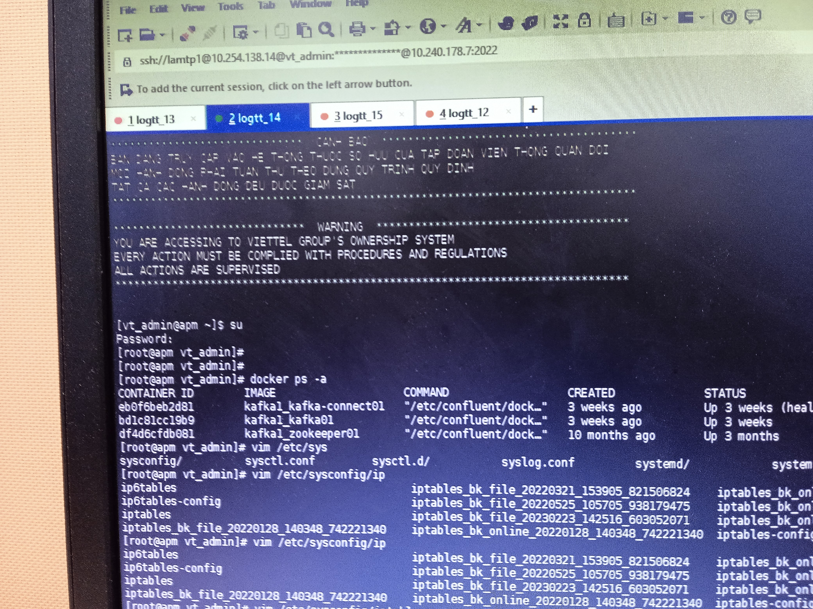

## `1. Lab test log tập trung nằm trên 4 server: 10.254.138.12-10.254.138.15`

- Con 10.254.138.12 chứa 4 thành phần: kafka, kafka-connect, td-agent service (active) và zookeeper. Tương ứng với 3 container:

- Con 10.254.138.13 chứa 5 thành phần: td-gent dạng container, kafka, kafka-connect, zookeeper, td-agent service (ko hoạt động):

- Con 10.254.138.14 chứa 4 thành phần: td-agent service (không hoạt động), kafka, kafka-connect, zookeeper:

- Con 10.254.138.15 chứa 5 thành phần: elasticsearch, kibana, kibana-exporter, docker-stats-exporter và td-agent service (ko hoạt động)

## `2. Port Mapping ở Container:`

### `2.1. Tại sao lại cần port_mapping ?`

Trước hết là do môi trường containers là môi trường cô lập (isolated) có hệ thống network và địa chỉ ip riêng so với máy host. Mặc định, các port trong container không thể truy cập vào từ ngoài container. Port mapping cho phép  ta expose (lộ) các port của container cho máy host, khiến thông tin trong  container có thể truy cập từ các server khác. Ngoài ra còn các lý do sau:  

- `Khả năng truy cập (Accessibility):` port mapping giúp enable khả năng truy cập đến service của các container hoặc ứng dụng từ các server khác trong mạng, giúp cho các developer, tester và  user khác truy cập được.

- `Bảo mật (security):` port mapping giúp nâng cao bảo mật bằng cách cho phép port nào được expose, port nào bị hidden. Mặc định, chỉ có những port mà ta mapping mới có thể truy cập từ máy host, từ đó giúp ngăn chặn các kết nối ko mong muốn.

- `Khả năng mở rộng (Scalability):` port mapping giúp tăng cương khả năng mở rộng theo chiều ngang bằng việc cho nhiều instance của một container chạy trên một máy host, mỗi instance sẽ chạy trên một port khác nhau. Điều này giúp cân bằng tải, tăng hiệu năng và dự phòng.

### `2.2. Ví dụ:`

Khi gõ:

        docker ps -a

Ta sẽ được kết quả như ở dưới:

Ta lấy thông tin về port của kafka connect làm ví dụ. Dòng `0.0.0.0:8083->8083/tcp, 9092/tcp` có nghĩa là container đang listen port 8083 và 9092 và máy host đang map port 8083 của nó tới port 8083 và 9092 của container.

- `Lưu ý:` có thể mapping nhiều port của container vào một port của máy host. Link: https://stackoverflow.com/questions/37690573/can-docker-map-multiple-container-ports-to-one-host-port

ip 0.0.0.0 là một ip đặc biệt, nó đại diện cho toàn bộ ip ở máy host. Ở dòng `0.0.0.0:8083->8083/tcp, 9092/tcp`, điều này nghĩa là port của container được bind với tất cả ip trên máy host.

Tóm lại, `0.0.0.0:8083->8083/tcp, 9092/tcp` nghĩa là mọi traffic được gửi đến port 8083 của máy host sẽ forward thẳng tới port 8083/tcp của container.

Format của port mapping sẽ như sau:

        HOST_PORT:CONTAINER_PORT/PROTOCOL

