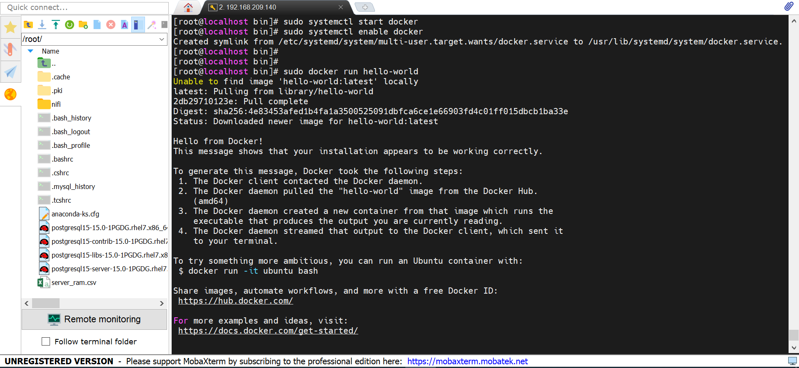
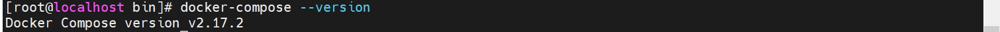

`I. Cài docker CE`

1. Gỡ cài đặt các phiên bản docker cũ:

        sudo yum remove docker docker-client docker-client-latest docker-common docker-latest docker-latest-logrotate docker-logrotate docker-engine

2. Cài các thư viện yêu cầu:

        sudo yum install -y yum-utils device-mapper-persistent-data lvm2

3. Thêm Repo của Docker:

        sudo yum-config-manager --add-repo https://download.docker.com/linux/centos/docker-ce.repo

4. Cài docker CE:

        sudo yum install docker-ce docker-ce-cli containerd.io

5. Start và Enable docker service:

        sudo systemctl start docker
        sudo systemctl enable docker

6. Verify docker CE đã cài Oke bằng cách chạy container `Hello-world`

        sudo docker run hello-world

Nếu đã cài đặt thành công thì sẽ như hình dưới:

`II. Cài docker compose`

1. Tải về phiên bản mới nhất của Docker Compose:

        sudo curl -L "https://github.com/docker/compose/releases/latest/download/docker-compose-$(uname -s)-$(uname -m)" -o /usr/bin/docker-compose

Lưu ý: Nếu muốn cài đặt phiên bản cụ thể, bạn có thể thay thế "latest" bằng phiên bản mà bạn muốn tải về.

2. Cấp quyền thực thi cho tệp tin Docker Compose:

        sudo chmod +x /usr/bin/docker-compose
3. Kiểm tra xem Docker Compose đã được cài đặt thành công bằng lệnh sau:

        docker-compose version

Nếu kết quả như hình dưới là ổn:

4. Mở port firewall

- list ports xem đã có port cần mở: 

        sudo firewall-cmd --list-ports

- mở ports:

        sudo firewall-cmd --add-port=8080/tcp --permanent
        sudo firewall-cmd --reload

- nếu vẫn ko có kết nối thì tắt firewall

        systemctl stop firewalld

        

## Build docker với tên docker-compose.yml khác:

                docker-compose -f docker-compose_2.yml up -d --build

