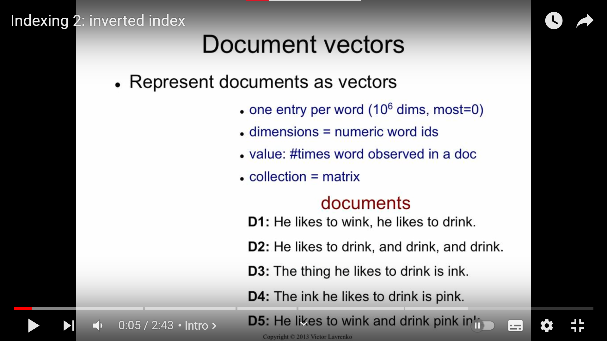
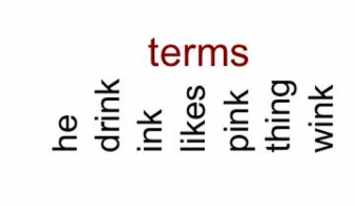
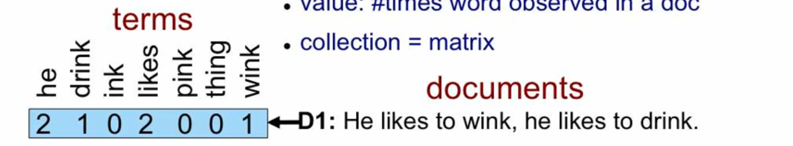
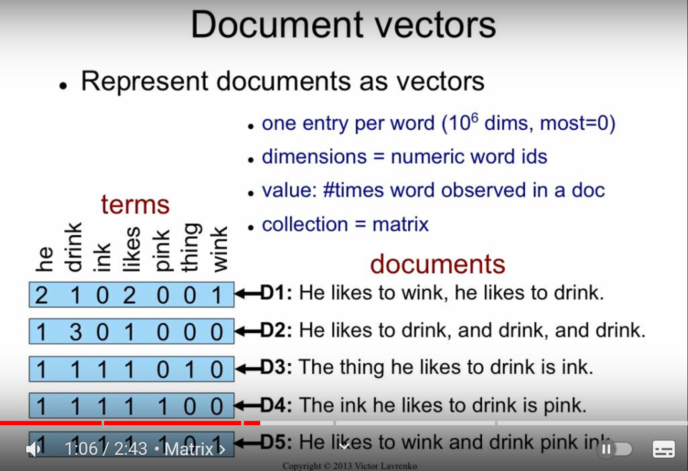

<h1 style="Inverted Index">1.Index</h1>

<h1 style="Inverted Index">2.Elasticsearch inverted Index</h1>

Trước hết, ở Elasticsearch, inverted index được coi là một cấu trúc dữ liệu trong Elasticsearch giúp tăng cường tốc độ tìm kiếm cho elasticsearch (full-text search).

Hãy tạm coi tập các Documents trên là một index. Và `term` là tập hợp các từ xuất hiện trong cái index này. 

` Lưu ý `: `term` khác với `field`, `field` tương ứng với `column` ở CSDL quan hệ. 

Chúng ta sẽ lưu số lần xuất hiện của mỗi `term` trong 1 document như hình dưới:

VD trên, term `he` trong document 1 (D1) xuất hiện 2 lần, term `drinks` 1 lần, term `likes` 1 lần...

Các document còn lại tương tự, cuối cùng ta có một ma trận sau:

==> Về cơ bản ta có thể coi tập hợp các Documents (còn gọi là index) là một `Ma trận `. Mỗi hàng sẽ là 1 Document - 1 row vector.

Vậy nên `Inverted index` bản chất chính là cột (column vector) của ma trận đấy. Còn indexing là ma trận chuyển vị (Transpose) của Ma trận ban đầu. Nghĩa là, nếu nhìn vào mỗi cột thì cột đó sẽ cho ta biết từ này xuất hiện ở document nào và xuất hiện bao nhiêu lần. VD ở cột 1, từ `he` hay term `he` xuất hiện 2 lần ở Doc 1,và 1 lần ở các Doc từ 2->5.

- Mỗi column vector sẽ là một `inverted list`.
- Mỗi column cũng đại diện cho 1 `term`.

## ` *Lý do lại gọi là inverted ?`

Có thể hiểu ban đầu việc index được tạo ra để biết `số lần xuất hiện của MỖI TỪ trong MỘT Document`, nhưng sau khi tạo một ma trận gồm nhiều document, thay vì sử dụng các row trong ma trận (`số lần xuất hiện của MỖI TỪ trong MỘT Document`) ta sử dụng column (`số lần xuất hiện của MỘT TỪ trong MỖI Document`).

`Inverted index` rất nhanh do sẽ không có keyword nào bị trùng lặp trong index, và mỗi word sẽ trỏ trực tiếp đến các row(s) mà nó xuất hiện.

## `2.1 sự khác biệt giữa text và keyword:`

Link tham khảo: https://stackoverflow.com/questions/52845088/difference-between-keyword-and-text-in-elasticsearch

https://kb.objectrocket.com/elasticsearch/when-to-use-the-keyword-type-vs-text-datatype-in-elasticsearch

Nếu ta định nghĩa type của một trường là keyword như đoạn query dưới:

         PUT products
        {
        "mappings": {
            "_doc": {
            "properties": {
                "name": {
                "type": "keyword"
                }
            }
            }
        }
        }

Thì khi ta muốn search trường này, ta sẽ phải insert cả cụm keyword (keyword search) vào thì ES mới hiểu, VD ta insert value `washing machine` vào field `name` của 1 document

         POST products/_doc
        {
        "name": "washing machine"
        }

Nếu ta muốn tìm document này, ta sẽ phải gõ cả cụm từ `washing machine` nếu không sẽ ko tìm được document, nếu ta query dòng dưới này thì ES sẽ ko cho ra kết quả:

        GET products/_search
        {
        "query": {
            "match": {
            "name": "washing"
            }
        }
        }

text được phân tích - analyzed trong quá trình index để hỗ trợ `partial matching` còn keyword thì không. Nghĩa là text sẽ được bổ ra thành các `term` trong lúc index để khi chỉ cần nhập 1-2 từ trong một câu thì elasticsearcch vẫn tìm ra được document có chứa từ ấy. VD  value ` tôi là lâm `  thuộc field `name` có type là text: `name: 'tôi là lâm' ` nằm trong document a trong index x thì khi tìm từ ` tôi ` sẽ cho ra được chính xác docment có xuất hiện từ ` tôi ` này, là docment a. Còn nếu type là keyword thì nếu chỉ gõ ` tôi ` khi search sẽ ko hiển thị kết quả. Buộc phải gõ cả cụm ` tôi là lâm ` mới cho ra kết quả là document a

=> nếu thường xuyên search thì để type là text, còn không thì để keyword cho index nó nhanh.