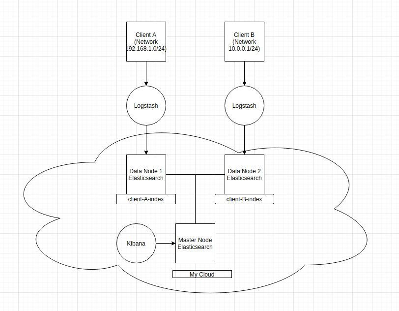
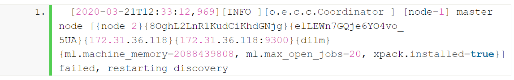

`Master node`: có tác dụng điều khiển Cluster hay còn gọi là Cluster wide operations (tạo và xóa index, theo dõi xem index nằm ở các node nào, điều phối shards tới các node khác nhau, và healthcheck)

` Data node`: lưu trữ dữ liệu và index.

` Client node`: Load balancer (không phải data lẫn master nodes)

` Coordinating node`: mỗi node đều mặc định là một coordinating node nếu không được set role thông qua `node.roles`. Việc tìm kiếm sẽ chia làm 2 giai đoạn sau:

- `Scatter phase`: coordinating node forward các request đến data node. Mỗi data node sẽ xử lý request cục bộ (locally) và trả kết quả về coordinating node.

- `Gather phase`: coordinating node sẽ reduce kết quả của từng data node thành duy nhất 1 tập kết quả toàn cục (global result set).

các node này cần có đủ bộ nhớ và CPU để chịu được `gather phase`

Cần xem kibana đang trỏ đến node nào, nếu trỏ đến node đang bị down thì sẽ không thấy thông tin gì trên dashboard.

Ví dụ:

Để đảm bảo Elasticsearch cluster hoạt động bình thường, quan trọng là Master node phải up và hoạt động. Trong tình huống mà Master node gặp sự cố hoặc bị ngắt kết nối khỏi cluster, Elasticsearch sẽ lại bắt đầu quá trình discovery (để tìm một Master node mới).

Ta có thể theo dõi quá trình discovery này ở INFO logs của Elastic cluster như hình dưới

Nếu có các `node master eligible` trong cluster và thuật toán điều phối cụm `(cluster coordination algorithm)` có thể tìm được Master node mới thì OK. Nhưng nếu không thể tìm được Master node mới thì hệ thống sẽ hiển thị thông báo cảnh báo (`WARN`) ở hình trên khi truy cập vào log của Elastic.

>Link: https://opster.com/analysis/elasticsearch-master-node-failed-restarting-discovery/

Có thể không cần master node nếu cluster nhỏ (ít hơn 10 nodes) nếu lớn hơn thì bắt buộc phải có master. Nếu việc quản trị của Master node bị ảnh hưởng bởi các quá trình xử lý dữ liệu khác => cần một node master riêng.

>Link: https://stackoverflow.com/questions/30692770/do-we-need-a-separate-master-node-with-a-small-elasticsearch-cluster

## `Tổng kết lại`

Cluster vẫn OK khi bị mất một node bất kỳ nếu đảm bảo những điều kiện sau:

- Cluster health là `green`

- Có ít nhất là 2 data node trong cluster.

- Mỗi index đều có ít nhất một replica tương ứng với mỗi primary shard.

- Cluster có ít nhất 3 master-eligible node, thỏa mãn điều kiện ít nhất 2 node không phải voting-only master-eligible node.

- Clients  được config để gửi request của họ tới nhiều hơn một node hoặc được config thành một load balancer có chức năng balance request trên một tập các nodes. `Elastic Cloud Service` cung cấp cho ta một giải pháp LB như vậy.

>Link: https://www.elastic.co/guide/en/elasticsearch/reference/current/high-availability-cluster-small-clusters.html

