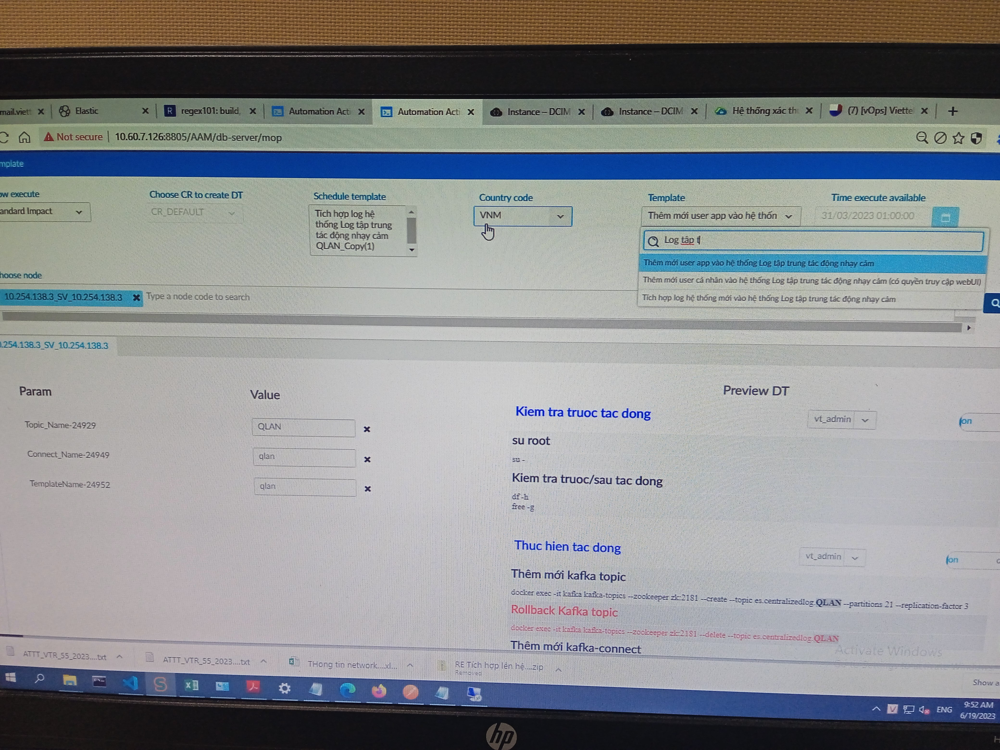

- Các nodes trong Elasticsearch mặc định vừa là `ingest` vừa là `coordinating` node, có khả năng transform docs để đánh index và cân bằng tải.

<h2 style="color:gold">Zookeepr ports</h2>

Giả sử bạn có 3 server cho zookeepr ... Bạn cần đề cập trong cấu hình như sau:

    clientPort=2181
        server.1=zookeeper1:2888:3888
        server.2=zookeeper2:2888:3888
        server.3=zookeeper3:2888:3888

Trong số những server này, một server sẽ là `Master` và tất cả còn lại sẽ là `Slave`.

Server lắng nghe trên ba cổng: 2181 cho các kết nối máy Client; 2888 cho các kết nối follower, nếu Kafka trên server này đóng vai trò là `Master` ; và 3888 cho các kết nối với Server khác trong giai đoạn tiến cử `Master`.

## ` Elasticsearch documents`

elasticsearch documents cũng tương tự row (record) trong CSDL rdbms thường gặp

## ` Đối chiếu Elasticsearch và SQL`

>phần quan trong của mỗi dự án là khả năng truy cập cơ sở dữ liệu. `INDEXING` là quá trình giúp ta có thể có kết quả từ Database một cách hiệu quả

>*Càng nhiều Elasticsearach node thì tốc độ tìm kiếm càng nhanh và tăng khả năng lưu trữ của Cluster*

>Băng thông (Bandwidth): ảnh hưởng đến khả năng truyền dữ liệu giữa các node trong Cluster

>Các node elasticsearch có 2 network interfaces, một cho client gửi request tới API của ES qua `HTTP interface`, một cho các node trong cluster giao tiếp với nhau thông qua `transport interface`.

>Chúng ta có thể phân phối docs thông qua các shard. Shards chia số lượng lớn các docs thành các pieces và để chúng được xử lý bởi các node khác nhau. Chúng ta không thể configure để dữ liệu đc gửi đến một node nhất định, nhưng ta có thể config để store một nhóm các data tương tự vào một shard bằng routing.

>` Lý do phải chia thành các shard:` Shards là đơn vị mà Elasticsearch phân phối dữ liệu trong Cluster. Tốc độ mà Elasticsearch có thể di chuyển các shard khi cân bằng lại dữ liệu (rebalancing data), ví dụ: sau một lỗi, sẽ phụ thuộc vào kích thước và số lượng shard cũng như hiệu suất mạng và ổ đĩa.

>` Lý do phải chia thành các segment:` 

## *Đa phần index trong elastic của hệ thống log tt là shrink index (80%)* 

Lệnh check xem port này đang chạy exporter gì

        curl –XGET http://10.254.138.3:20451/metrics

đây là check exporter của ES, còn Kafka và zk là port 20551 và 20651

còn port 20125 khi dùng docker ps -a là port của docker exporter mình tự thêm

lệnh hiển thị các exporter 

        ps -ef | grep exporter

sau đó dùng kill -15 [PID] để kill exporter process 

kiểm tra lại file /var/log/td-agent/BCCS Payment.pos để xem đã đẩy log lên chưa.

- Trường Start_time: là thời điểm có người tác động vào DLNC.
- Trường End_time: là thời điểm kết thúc tác động vào DLNC.

` * Lưu ý khi tạo index trên Log tập trung`

`I.` Các bước cần làm phía đẩy log
1. Kiểm tra môi trường trước khi cài đặt td-agent (HĐH)
2. install agent theo HD v10 (gửi format log, log mẫu cho người ta cấu hình - file cem.txt). `Lưu ý:` Mình chỉ gửi HD cài agent, không cần quan tâm bên muốn đẩy log làm gì, họ sẽ phải tự trao đổi với VHKT (để xin cấp quyền root truy cập...), nếu VHKT gặp khó khăn thì họ sẽ tự trao đổi với mình.
3. Gửi log cho mình để xem đã đúng chuẩn (33 trường vs UD thường, 15 với log tổng đài, các trường Start/End_time chuẩn iso 8601)
4. Làm PYC mở kết nối (đã lưu mail) tới log tt
5. Báo lại khi log đã đúng chuẩn và gửi lên.

`II.` Các bước cần làm phía nhận log
1. Tạo topic cho hệ thống.
2. Kiểm tra Log đã lên kafka = lệnh kafka consumer, nếu log sai trường Start/End_time mà đơn vị vẫn muốn log lên bằng được => tạo index template theo HD rồi lên elastic sửa lại phần mapping thay type của trường Start/End_time từ Date => text.
3. Tạo kafka connect (phải tạo connect sau index template để tránh elastic tự tạo 1 default index gồm 1 primary shard và 1 replica shard khi kafka connect đẩy log)
4. Kiểm tra trên elastic xem đã tồn tại indices chưa: Management/Stack Management/Data/index management/indices.
5. Tạo chart để view: ../index management/Kibana/index patterns.

`III. ` Các lỗi hay gặp và lưu ý:

1. Quên chưa sửa template từ date -> text nhưng vẫn có 1 indice chuẩn gồm 8 primary shard - 1 replica shard, tuy nhiên indices này ko có log hoặc có 1 hoặc 2 log. 
==> chỉnh lại Start/End_time của template này thành type text. Sau đó xóa indice cũ rồi F5 xem có log chưa. 
` * Trường start time quan trọng và phải chuẩn do là thời điểm tác động vào dữ liệu nhạy cảm, cần trường này để trace vết. `

2. Log của 16 hệ thống VTT ban đầu để sai Start/End_time => phải lưu tạm dưới dạng text => cần sửa lại để tháng sau lưu định dạng mới. Hiện tại Log của VTT đang dùng policy riêng, sau 1 tháng là xóa log. Nếu index_template ban đầu lưu Start time dạng text sau đó sửa thành date => log mới lên sẽ KHÔNG ăn theo template mới này mà vẫn lưu dưới dạng cũ (Kể cả Datetime đúng chuẩn thì lên elastic Discover log vẫn là dạng text) trừ khi xóa index hiện tại đi thì mới ăn theo định dạng mới. 

==> làm vậy sẽ mất log, đằng nào 1 tháng nữa cx bị delete nên sửa trước template và đợi log cũ bị rotate và ăn theo template mới

` Chú ý:` Dấu phân cách trong dòng Log phải giống vs dấu phân cách trong Log format ở td-agent, ví dụ:
Log format có phân cách là `|` thì dòng log cx thế. 

3. TH log đã cấu hình đúng Start/End_time và đã tạo index_template đúng kiểu date nhưng chưa thấy Log
==> kiểm tra file log của kafka-connect ở /u01/logtt/kafka-connect/log/kafka-connect.log. Ta sẽ thấy kafka-connect đang đẩy dở log của những ngày trước (những ngày mà định dạng chưa sửa nên sẽ không lưu trên elasticsearch). ==> Chỉ cần đợi cho đến ngày mà log đã đúng chuẩn là nó sẽ tự lên index.

` Các bước pull docker image từ server nội bộ viettel:`

## Tips: `Tên Indice = tên topic viết thường` => tên indices ăn theo topic, tốt nhất để tránh nhầm thì tên của connect, template sẽ là từ tên topic viết thường/.

- các service trong file docker-compose tương đương với zookeeper, kafka-connect, kafka => là các thành phần cần thiết để build lên app (log tập trung). Mỗi service = 1 container
- để chạy docker-compose, trước hết phải build dockerfile để tạo ra image, sau đó từ các image này docker-compose sẽ chuyển thành các containers của service (es, kafka, zk) => Logtt. Việc build dockerfile có thể được định nghĩa trong docker-compose như hình dưới:

  

Ở hình trên thì dockerfile chứa thông tin về environment của zoo nằm ở thư mục ./zookeeper, thư mục này ngang hàng với file docker-compose nên sẽ có dấu ./ chỉ thư mục hiện tại.

Ở hình dưới thì dockerfile nằm ngang hàng với docker-compose nên chỉ có ./

Có 2 cách set biến môi trường, 1 là trong Dockerfile với biến `ENV`, 2 là trong docker-compose với key name `environment`:
> In Docker, there are two main ways to set environment variables: using the ENV instruction in the Dockerfile or using the environment key in the docker-compose.yml file.

> The main difference between the two is that the ENV instruction in the Dockerfile sets environment variables that will be available in the image at runtime, while the environment key in the docker-compose.yml file sets environment variables that will be available to the container when it runs.

> In other words, the ENV instruction sets environment variables that are baked into the image, while the environment key sets environment variables that are specific to the container. The latter can be useful for setting container-specific configuration values or secrets that are not known at build time.

> Another difference is that you can use the ENV instruction to set default values for environment variables, while the environment key in the docker-compose.yml file is used to override default values or set new ones.

- Trong file .env ở file ES.zip chỗ tích hợp Elasticsearch, có các thông tin về password của ES và thư mục chứa cert trong container, khả năng phải được mapping với thư mục ~/docker-compose/elasticsearch/_data/ như trong hướng dẫn. Password thì ở trong file này, nhưng thông tin user (elasticsearch) lại trong Dockerfile, là tên user chạy container ấy, nếu có 2 container chạy elasticsearch thì sẽ có 2 user elasticsearch.

- Phần volumes trong docker compose: đường dẫn bên trái là của máy host, bên phải của container.

- UID trong dockerfile bằng UID của user logtt = 1001

=> Đây là đoạn map uid (kafka, elasticsearch, fluent...) chạy mỗi container với user id của user logtt. Lý do mount:

## `OS sẽ thấy user logtt chạy container ấy, không phải user elasticsearch, kafka, fluent trong container chạy container ấy. Kiểu như gán quyền chạy container cho user logtt`

- Mỗi dòng log trong file log = 1 document dạng json với các cặp key-value
-  indexing (hành động ghi các document vào shard)

## Fix lỗi su sang user logtt, lỗi resource unavailable temporarily do vượt số process nproc:

                vim /etc/security/limits.conf

Vào file này sửa nproc và nofile của user logtt lên như hinh dưới hoặc để là unlimited

đổi pass cho user logtt thì dùng lệnh:

                passwd logtt

## Lỗi log không đẩy được lên ở Windows Server:

- Sửa lại suộc của path đẩy file lên là OKE, do path linux khác windows và chú ý phải thêm định dạng file ở cuối (.txt, .log,...):

- Sau khi sửa file conf thì nhớ restart lại service, ở trong tab như hình dưới:

- Lập tức, file log pos mới sẽ được tạo ra:

- Trong file log pos sẽ hiện lên các file log có cùng định dạng ActionLog*.txt

## Các lưu ý khi dùng AAM:

1. Template name $1 trong file script template ở /u01/logtt = @[TemplateName] - tên biến trên AAM

2. Phần chọn template ở mục create mop trên AAM = template được tạo ở mục workflow

3. Workflow là tập hợp các actions:

4. Mỗi action thực chất là một command với tên riêng.

=> Muốn tạo template mới thì vào Manage flow work trên AAM. Còn muốn tạo command mới thì vào managae command.

5. Để tác động trên AAM thì vào create MOP, chọn mop nào có status là editable (Tích hợp QLAN) và clone, sửa tên trong MOP thành tên của hệ thống muốn tích hợp. Sau đó lưu MOP, vào `Execute impact`, search tên MOP vừa tạo ở mục `Template`, di chuột vào cột `Action`, chọn `Execute DT`, double click vào ô đầu để chạy MOP => Waiting => Done.

## Lệnh trace để check kết nối:

                traceroute -nT -p 9092 10.254.138.3

## Check kafka producer TPS:

1. Vào kafka container:

                docker exec -it [id_container] bash

2. Vào /bin, check xem có kafka-producer-perf-test chưa:

                ls | grep kafka-producer-perf

3. Gõ lệnh (nhớ thay thông tin):

                kafka-producer-perf-test --topic your_topic_name --num-records 100000 --record-size 1000 --throughput -1 --producer-props bootstrap.servers=your_kafka_broker_host:9092

Kết quả sẽ như sau:

                100000 records sent, 19261.240987 records/sec (18.38 MB/sec), 184.89 ms avg latency, 203.00 ms max latency.

bao gồm TPS (records/s), độ trễ trung bình và tối đa cũng như thông lượng (MB/s). Thông số này cho ta biết tốc độ mà Kafka topic được xử lý, từ đó giúp ta đánh giá hiệu năng của kafka cluster. `--throughput -1 `option sets the maximum throughput, allowing the producer to send messages as fast as possible.

VD với hệ thống thật:

- SỰ KHÁC BIỆT SO VỚI `kafka-consumer-perf-test:` It simulates a workload where messages are consumed from a Kafka topic. It helps assess the performance and scalability of the Kafka consumer, including the processing rate and latency.

## Cách để đảm bảo 1 file log tự động sinh ra nhờ log rotate trong folder chứa log có permission 775 cũng sẽ có permission 775.

The permissions of a newly created file during log rotation are determined by the umask settings and not directly inherited from the parent directory's permissions.

The umask is a value that determines the default permissions for newly created files and directories. It subtracts the specified mask from the default permissions. By default, the umask value is usually set to 022, which means the write permission for the group and others is removed when creating new files.

In the case of log rotation, if the umask is set to 022 and the parent directory has permissions 775, the newly created log file will have the default permissions of 644 (owner read/write, group read, others read).

To ensure that the rotated log files have the desired permissions, you can modify the umask setting before performing the log rotation. For example, you can temporarily set the umask to 000, which would result in the newly created log files having permissions of 775. After the log rotation is complete, you can revert the umask to its original value if desired.

Please note that the exact configuration and behavior may vary depending on the specific log rotation mechanism or tool being used. It's always recommended to review the documentation or settings of the log rotation tool you're using to understand its behavior and how permissions are managed during log rotation.

                sudo vi /etc/profile

tìm dòng có đoạn umask, sửa theo cái mình muốn

                umask 000

Sau khi sửa xong thì save file, thoát ra login lại hoặc restart lại system sẽ kích hoạt effect.

## Hardening server để có repo

B1: Vào con 241 (10.60.129.241)

B2: Vào thư mục chứa file inventory, file này chứa thông tin các server định hardening và account password của server mình định cấu hình, ở đây là root/123456:

                cd /u01/labratory/tungns17/auto_new

Sửa thông tin trong file thành server mình định hardening

B3: chạy lệnh sau để hardening:

                ansible-playbook -i inventory_logtt auto_hardening.yml

Ghi chú:
Sau khi hardening sẽ không thể ssh từ 241 đến account root của logtt nữa mà phải qua vt_admin, file chứa thông tin password của vt_admin nằm ở thư mục `/u01/labratory/autoscripts/Hardening_Centos7.x`, đường dẫn này lại nằm trong file auto_hardening.yml nằm ở `/u01/labratory/tungns17/auto_new`:

Trong thư mục Hardening_Centos7.x sẽ có script `Fix_Security_Baseline.sh` chứa thông tin về pass vt_admin, mặc định là `2`.

Nội dung bên trong file này:

### Lệnh thay user cho toàn bộ thư mục:

                chown -R logtt:logtt /01/logtt

### Khai báo repo cho docker:

                vim /etc/docker/daemon.json

Copy nội dung của file daemon.json của server đang chạy khác

### Reload lại daemon để docker.service được load về vị trí ban đầu, nếu không thì khi start sẽ bị lỗi failed to start, unit docker.service not found.

                systemctl daemon-
                
## Cách fix lỗi Connect timeout khi cài agent dạng docker trên centos 6 (6.6)

1. Sửa docker-compose phần `net` từ `bridge` sang `host` như sau:

2. Xóa bất kỳ container cũ nào nếu còn:

        docker stop [container_name/id]

        docker rm [container_name/id]

3. Xóa image cũ để tránh docker-compose sẽ tự lấy image cũ nó vừa build vì có tag (latest) như nhau. Image cũ có thể sẽ không có thông tin định thêm trong Dockerfile

        docker rmi [image_id]

4. Build lại:

        docker-compose up -d

## Cách thêm gói vào trong container khi cài agent dạng docker trên centos 6 (6.6)

1. Copy package (vd:traceroute.dpkg) định cài vào thư mục gem đã giải nén trong hướng dẫn, do hệ điều hành trong container là debian nên cài gói dpkg.

2. Sửa Dockerfile như trên để run container bằng user root trong container, phải chạy = root thì mới cài được gói và dùng lệnh được:

` Lưu ý `: nhớ chỉnh lại user root = fluent khi test xong kẻo BO ứng dụng cho ăn hành

3. Xóa container và image cũ như HD trên.

4. Build lại

Sau khi build xong có thể tự do dùng user root trong container và su root container từ user UD bên ngoài host:

        docker exec -it -u 0 [container_name/id] bash

## Build 2 services 1 file compose hay 1 service 1 file:

- Việc build 2 servies 1 file compose hay 1 service 1 file như nhau bởi nó vẫn ăn theo image đầu tiên được tạo (tất cả images khi dùng lệnh docker images chỉ khác tên repo nhưng cùng image ID), giải thích được tại sao ports trong container thứ 2 bao gồm cả các port trong container đầu. 

### Lệnh xóa toàn bộ container:

                docker container prune -f

### Lệnh xóa toàn bộ images:

                docker image prune -af

### Lệnh nén cả file hidden:

                zip -r archive_name.zip .*

### Lệnh add user vào sudoers group:

                usermod -aG wheel newuser

### Lệnh remove các package docker

                sudo yum remove 'docker*'

### Lệnh cài docker (chưa có compose)

                sudo yum install docker-ce docker-ce-cli containerd.io docker-buildx-plugin docker-compose-plugin

### Nếu gặp lỗi file not found khi dang tien hanh mount thì do container vẫn đang dùng volume setting cũ nên không hiểu được đường dẫn mới, phải xóa volume cũ đi:

                docker-compose down -v

### Add user vào docker-group để không dùng quyền sudo (copy trong con 170)

### Xem tất cả service và các port mà service đang listen:

                lsof -i -P -n | grep LISTEN

### Lệnh check rule của iptables để biết rule docker đã đc thêm chưa:

                iptables -L -n -t nat
                
### Lệnh xem rule đã có trong iptables chưa:

                ip -nL | grep 172

### Gặp lỗi này khi build docker: `"Bash script – "/bin/bash^M: bad interpreter: No such file or directory"` thì làm như sau:

                # cài dos2unix
                yum install -y dos2unix

                # chuyển file sh từ dạng dos -> unix 
                dos2unix kafka-server-start.sh

### Các node trong cluster ko nói chuyện vs nhau:

- Thêm trường transport.port (=port của transport.pulish.port)
- Sau khi thêm vẫn ko được thì xóa data và log cũ rồi docker-compose up -d lại