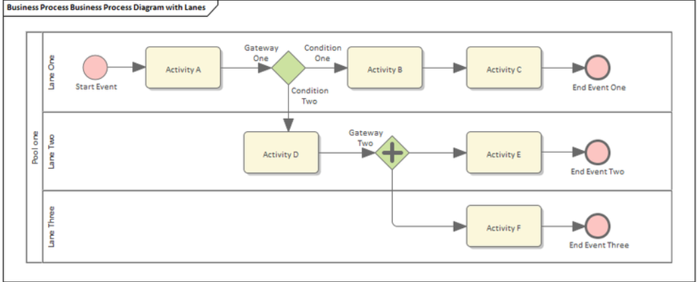
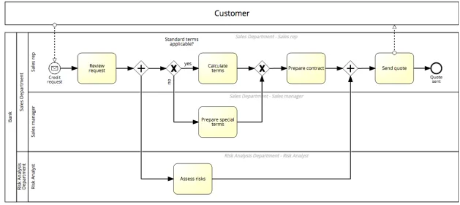
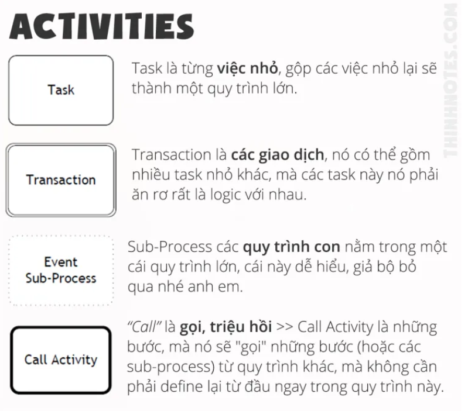
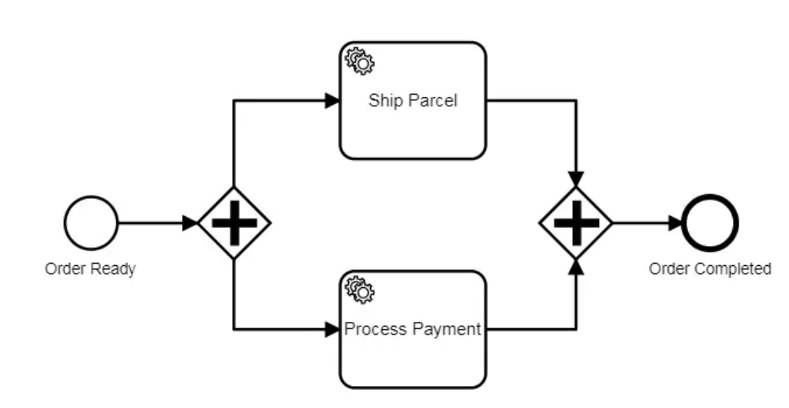
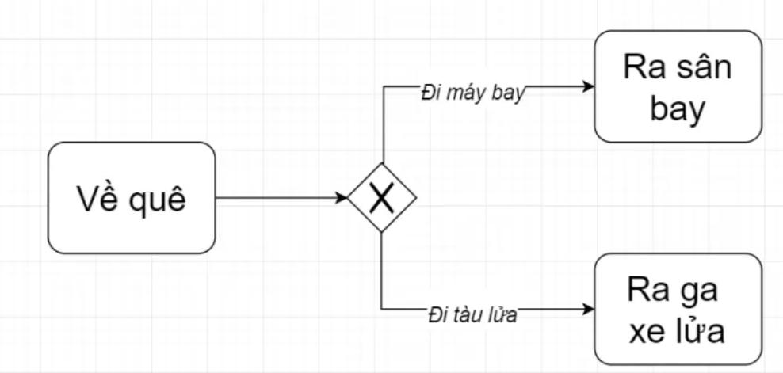
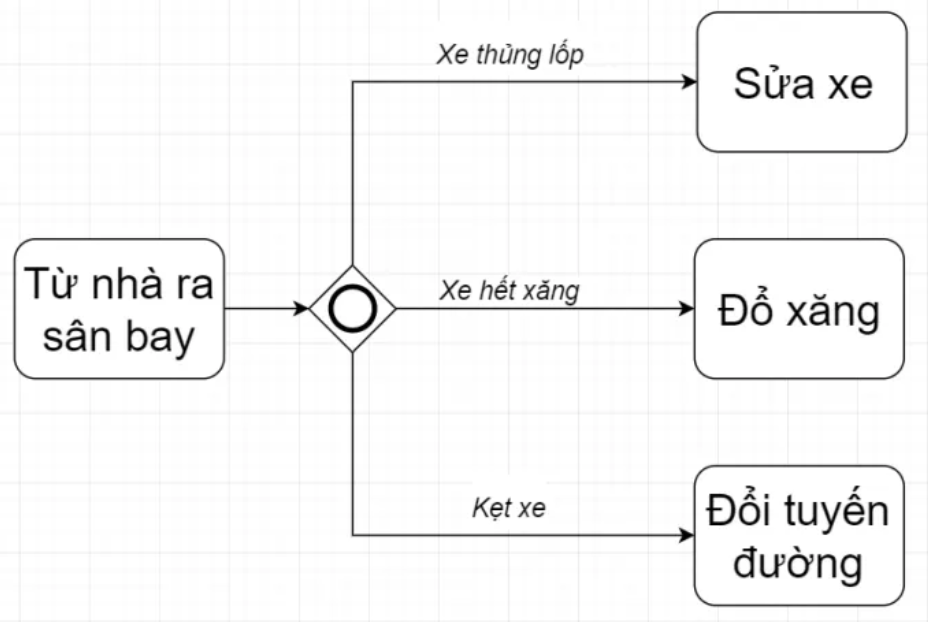
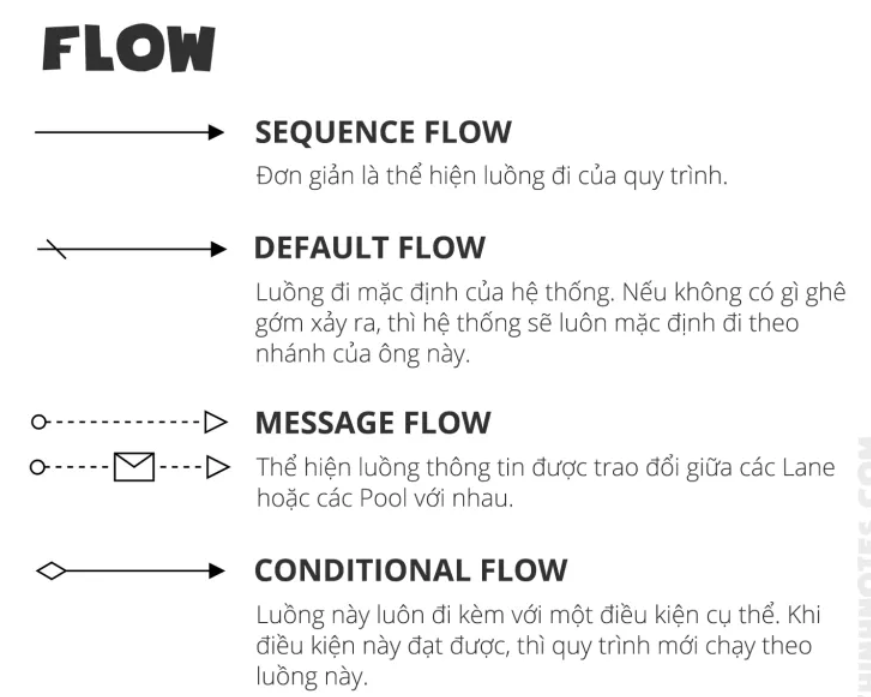
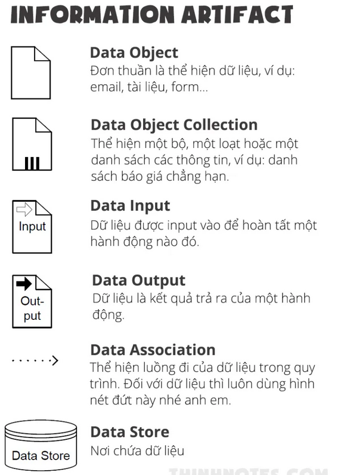

`1. Các công nghệ nền tảng`

`1.1. BPMN`

BPMN viết tắt của Business Process Modeling Notation, là tập hợp các ký hiệu chuẩn để mô tả quy trình của doanh nghiệp hay để mô hình hóa quy trình của doanh nghiệp. 

`1.1.1. Swimlanes`

Swimlane bao gồm Pool và Lane

- Pool thể hiện một tổ chức, một bộ phận, một phòng ban, một vai trò hoặc một hệ thống nào đó.
- Lane thể hiện các cá nhân riêng lẻ, người sẽ làm các hoạt động cụ thể.

`1.1.2. Activities`

Activity tập trung trả lời câu hỏi làm gì. Tức là nó mô tả tất cả các công việc có trong quy trình. Activity gồm 4 loại sau.

`1.1.3. Gateway`

Gateway là đối tượng điều khiển dùng để trộn hoặc phân chia các luồng thực thi. Vì vậy nó sẽ quyết định việc rẽ nhánh, trộn,... các luồng tiến trình với nhau tùy thuộc vào loại hành vi được chỉ định.
BPMN thì có rất nhiều Gateway, khoảng 68 cái. Tuy nhiên dùng nhiều nhất có 4 loại sau

`1.1.3.1. Parallel gateway (AND)`

Parallel Gateway nghĩa là các nhánh phải cùng xảy ra song song với nhau. Chỉ cần một trong các nhánh chưa được complete thì các nhánh khác không thể merge lại, và quy trình không thể đi tiếp được.

`1.1.3.2. Exclusive gateway (XOR)`

Một trong các action sẽ được thực thi. Việc lựa chọn phụ thuộc vào điều kiện logic tại Gateways.

`1.1.3.3. Inclusive gateway (OR)`

Inclusive Gateway cũng tương tự Exclusive Gateway, nhưng khác ở chỗ nó cho phép xảy ra nhiều nhánh, chứ không duy nhất một nhánh như XOR. Tuy nhiên một khi các nhánh được activate, nó phải được complete hết trước khi merge lại.

`1.1.4. Events`

- Event (sự kiện) là các loại sự kiện xảy ra trong quá trình thực hiện tiến trình. Những event này sẽ tác động đến luồng thực thi của tiến trình.
- 3 loại events thường dùng:
>Start Event: bắt đầu process xử lý không cần điều kiện kích hoạt.

> Intermediate Event: Event này xảy ra giữa start event và end event.

>End Event:kết thúc quy trình xử lý

`1.1.5. Flow`

`1.1.6. Information Artifact`

thể hiện một thứ rất quan trọng trong bất kỳ quy trình nào, đó là thông tin, dữ liệu.

