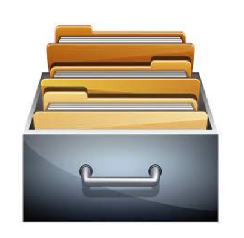

<h1 style="color:red"> Khác biệt giữa database và data storage </h1>

Data storage là một khái niệm về việc bạn lưu thông tin ở đâu và như nào trong một hệ thống số. Chúng ta lưu data ở storage system. Bình thường ta lưu dữ liệu với 2 cơ chế khác nhau là: Datafiles và Database. Vậy về cơ bản, database đề cập đến việc bạn lưu file của mình ` như thế naof`.

VD, đối với Azure, `cloudd storage` và `database` là 2 khái niệm hoàn toàn khác nhau. Azure DB bao gồm SQL DB, Maria DB, MySQL DB. Tuy nhiên, hãy nhớ rằng DB chỉ lưu các file DB của nó trong storage system. Bình thường, một storage account ở Azure được dùng để lưu các file phi cấu trúc. Nó cũng có thể là bất cứ file gì bao gồm DB file hoặc VM image file. Cosmo DB lưu các db của nó bằng Azure page storage account tích hợp bên trong. Azure cloud storage account định nghĩa cách bạn lưu data một cách vật lý, dịch vụ này còn hỗ trợ bảng và queue. 

Trước hết cùng tìm hiểu File system nếu muốn làm rõ sự khác biệt.

## `File system:`

Bạn dùng File system (FS) để đặt tên, lưu, locate và đọc data của mình. Nó chỉ đơn giản là phiên bản số hóa của một cabin đựng hồ sơ. Bạn đưa thông tin vào một file text sau đó đặt chúng vào một tập tin.

Bạn có thể đặt bất cứ gì bạn muốn vào một vị trí cụ thể. Bạn có thể lưu bất cứ loại dữ liệu nào bao gồm "Dữ liệu phi cấu trúc" gồm: documents, videos, spreadsheet, ảnh, nhạc...File system không care bạn lưu những gì. FS đọc và ghi dữ liệu vào ổ đĩa cứng ở trên máy bạn. Bất cứ ứng dụng mà bạn tạo hoặc dùng như media player, visual studio, máy tính,...Chúng đều được lưu trên FS trên máy của bạn. Từ FS chúng sẽ được ghi trên ổ cứng của bạn.

Khi bạn cài OS trên máy tính thì một FS sẽ được lưu trên máy bạn. Đối với Windows là FS là NTFS, với Linux sẽ là EXT.

## ` Khái niệm Database`

Tóm lại là một tập hợp data có tổ chức. Khi nhắc tới database, nghĩa là nhắc tới cả cấu trúc và thiết kế môi trường data cũng như bản thân dữ liệu. Nó lưu dữ liệu một cách phức tạp hơn so với `datafile`. DB thường lưu một lượng data entity với thông tin về cách các entity trên được sắp xếp hay quan hệ với nhau ra sao. Điều này mở ra khả năng  truy cập vào một mảng thông tin lớn hơn trong một môi trường lưu trữ chung so với việc lưu thông tin vào nhiều data files có thể không có quan hệ gì với nhau.

Thông thường, DB được xây dựng bởi một hệ thống quản lý DB (DBMS). DBMS là một phần mềm dùng để tạo, duy trì và truy cập DB.

CSDL quan hệ lưu thông tin dưới dạng bảng 2 chiều (2 dimension tables) và định nghĩa mối quan hệ giữa các bảng đó, một số CSDL quan hệ phổ biến: SQL Db, MySQL, PostgresSQL, MariaDB.

Có những loại db sau:

- CSDL quan hệ: SQL, MySQL, PostgresSQL, Maria DB

- CSDL phân tán:
    
    1. Graph DB
    2. Document Stores
    3. Columner DB
    4. Key-Value stores

CSDL không bảng (non-tabular) hoặc non-relational DB được gọi là NoSQL DB.

`Graph DB:` Amazon Neptune, Apache Cassandra