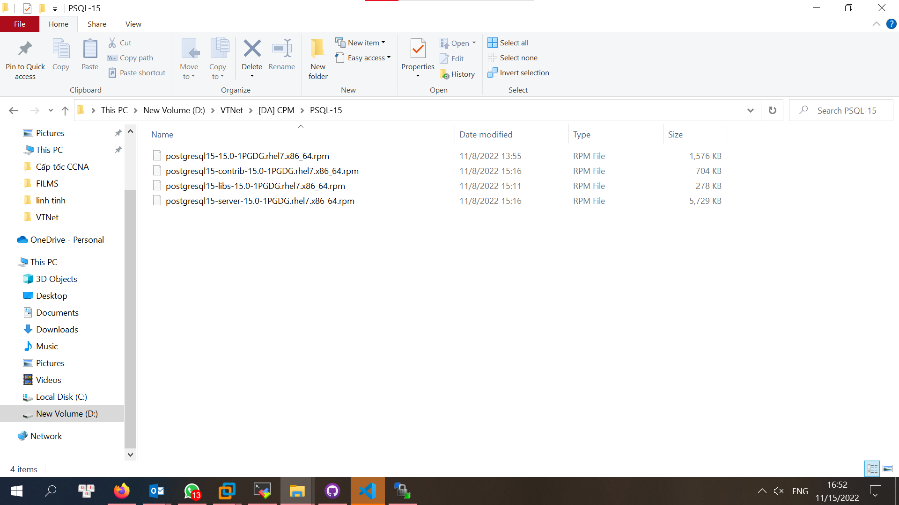
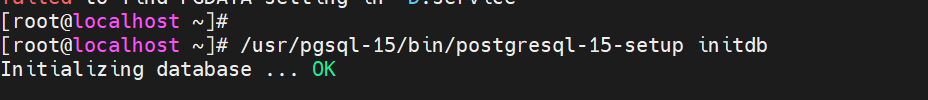
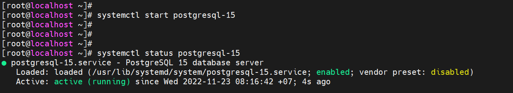

<h1 style="color:orange">Hướng dẫn cài Nifi sử dụng Postgresql</h1>

<h2 style="color:orange">1. Cài Postgresql-15</h2>

Tải các file rpm ở đường link sau và chuyển vào thư mục /home để cài.
https://yum.postgresql.org/15/redhat/rhel-7-x86_64/repoview/postgresqldbserver15.group.html

Các file sau khi tải xong. 
Sau đó dùng WinSCP để truyền file vào server rồi thay quyền sở hữu dùng:

    chmod 775 [tên file]

Nếu gặp lỗi trên thì phải cài thư viện `libzstd` trước bằng cách dưới:

    yum install epel-release
    yum install https://github.com/fdupoux/fsarchiver/releases/download/0.8.4/fsarchiver-0.8.4-1.el7.x86_64.rpm

Sau đó cài theo thứ tự:
1. postgresql15-libs-15.0-1PGDG.rhel7.x86_64.rpm
2. postgresql15-15.0-1PGDG.rhel7.x86_64.rpm
3. postgresql15-server.x86_64 0:15.0-1PGDG.rhel7
4. postgresql15-contrib-15.0-1PGDG.rhel7.x86_64

Tiếp đó, dùng lệnh sau để khởi tạo DB

    /pgsql-15/bin/postgresql-15-setup initdb

Kết quả hiển thị như hình dưới là OK

Start postgresql-15 và kiểm tra kết quả:

