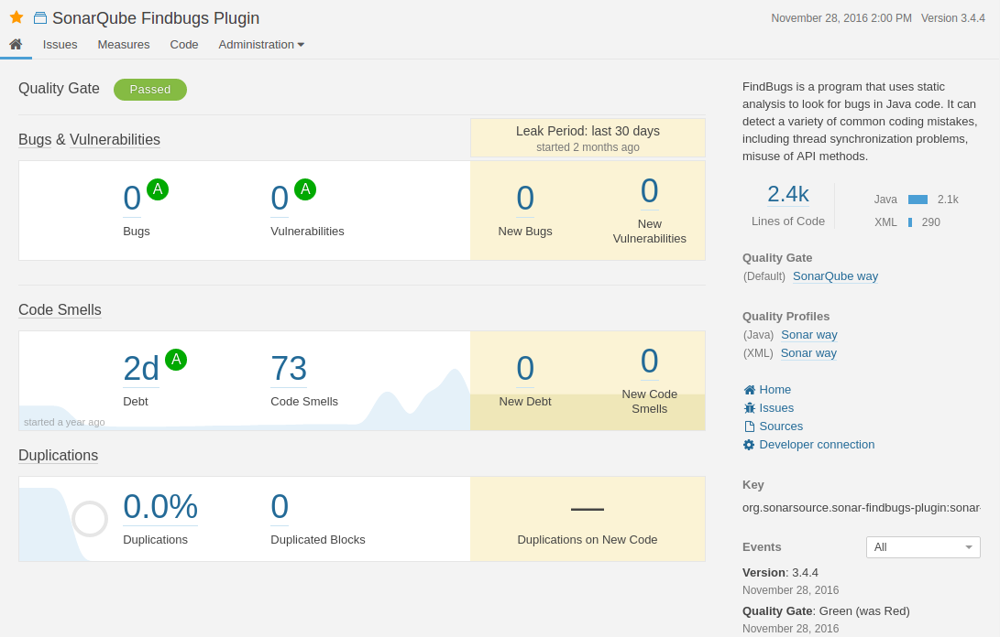

Bài viết dưới đây tham khảo từ link youtube: https://www.youtube.com/watch?v=PkNg9gUhiYQ
Nên có thể có những chỗ chưa chuẩn.

## I. Tổng quan về CI/CD

### 1. Quá trình từ khi code đến khi triển khai trên môi trường Product

CI/CD gồm 3 phần chính là: Continuous Integration, Continuous Delivery và Continuos
#### 1.1 Continuous Integration (CI) (liên tục tích hợp): 
+ `Bối cảnh`: một phần mềm được phát triển dựa trên nhiều chức năng và được mở rộng theo từng giai đoạn (phase) và trong từng phase lại có nhiều devs phụ trách. Các devs thì thường làm việc độc lập cho đến khi gần đến hạn triển khai thì mới ngồi lại với nhau để merge code dẫn đến lỗi. VD: Cùng một file mà mỗi người code một kiểu --> Conflict --> Code lại từ đầu --> Không đảm bảo tiến độ công việc.
--> Cần thay đổi phương pháp làm việc, update liên tục khi có thay đổi nào đó về code để mọi người cùng biết và góp ý.
+ `Đặc điểm của CI`: yêu cầu code của dev phải được liên tục tích hợp vào code chung của dự án để nếu có lỗi phát sinh có thể sớm phát hiện và fix tránh để gây ra các lỗi lớn hơn về sau. Để làm được việc này cần một công cụ tự động kiểm tra thay đổi của code ở trên `VCS (version control system)` gọi là `CI server`. CI server là thành phần trung tâm trong mô hình CI/CD (hình dưới) vì nó liên kết và điều phối hoạt động của các tool khác để tạo thành luồng công việc tự động gọi là `CI/CD pipeline`. 

+ `Các loại CI server phổ biến`: Jenkins, Gitlab CI, AWS... Phổ biến nhất là Jenkins do jenkins hoạt động trên mọi nền tảng, không phụ thuộc vào bên thứ 2, khả năng tích hợp với nhiều lại công cụ, được viết trên java và free nhưng cũng có nhược điểm là khó quản lý và không dễ dùng với người mới, là những điều mà Gitlab CI vượt trội hơn. Trong bài này ta sẽ nói về Jenkins.

+ `6 giai đoạn chính trong một luồng CI`:
1. Checkout code: Ngay khi phát hiện ra thay đổi trên VCS (github, gitlab) thì Jenkins sẽ tự động download về.
2. Static code analysis (review code): code sẽ được quét qua các công cụ như `SonarQube` để phát hiện được các đoạn code chưa được tối ưu hay chuẩn hóa như khối code bị lặp lại hoặc quá dài và đưa ra độ bao phủ của unit test (đơn vị kiểm thử nhỏ nhất trong testing, kiểm tra các class, method,.. trong code). Kết quả cuối là để biết code đã đạt tiêu chuẩn chất lượng chưa (clean code), VD:

3. Unit test: các hàm, class, method, procedures sẽ được test trên CI server để đảm bảo hoạt động trước khi build.
4. Build/Packaging: Sau khi qua bước unit test thì code sẽ được đóng gói thành các `Artifacts` hay `Runable unit` , các artifacts này tiếp tục được đóng gói thành các images. Các images này đã sẵn sàng để triển khai lên môi trường test (QA)
5. Triển khai lên môi trường QA: Các container sẽ được triển khai lên các môi trường test khác nhau tùy vào yêu cầu thực tế như: performance test, security test, UAT test, functional test... Đây là giai đoạn có thể nhìn được Ứng dụng khi có chức năng mới sẽ như thế nào.
6. Đánh giá: Tester thực hiện các bài test cases, test plan... Nếu các chức năng của app vượt qua bài test, chúng sẽ được lưu trữ và chò để triển khia trên môi trường Production (End User).

Đến đây là hết luồng CI, sau đó code sẽ được triển khai trên môi trường Staging (còn gọi là Pre-production) và mt production. Ở staging thì code cơ bản đã oke và đủ điều kiện triển khai trên môi trường Production tuy nhiên được ẻm lại chờ release theo chiến lược của công ty. Thực tế, việc deploy code lên mt production thường được thực hiện thủ công là chính để tránh sai sót có hệ thống vì đây là môi trường rất quan trọng, chỉ deploy tự động khi mà đã tự tin rằng các test cases và test plan trước đó đã cover hết mọi vấn đề.

#### 1.2. Continuos Delivery (CD) - Phân phối liên tục:
+ Cũng có 6 bước như phần CI ở trên, trừ bước test cuối sẽ được thực hiện tự động và app cũng sẽ được triển khai tự động lên môi trường staging

#### 1.3. Continous Deployment (CD) - Triển khai liên tục:
+ Gồm tất cả các steps của 2 luồng trên nhưng thêm bước là triển khai tự động lên môi trường Production.

`Túm lại:`
- CI bắt đầu từ khi code được đẩy lên github/gitlab đến khi triển khai lên môi trường test (QA).
- CD (Delivery) giống CI và thêm 2 bước nữa là triển khai lên Staging và Test toàn trình.
- CD (Deployment) giống 2 bước trên nhưng thêm bước triển khai lên môi trường Production --> toàn trình luôn, không cần sự trợ giúp của human.
 