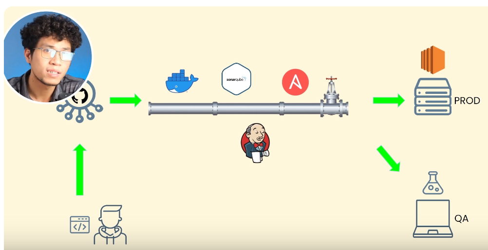
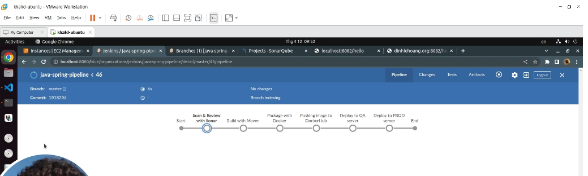

## Để test, ta cần chuẩn bị các tools sau:

1. Github
2. Docker
3. Jenkins
4. SonarQube
5. Ansible
6. EC2 - instance của Amazon

Sử dụng Java Spring để triển khai lên 2 môi trường là QA và Production. Môi trường QA là máy tính cá nhân (Laptop) và Production là VM được tạo ra bởi EC2, luồng như dưới

Mục tiêu: Sửa code và đẩy lên github, chờ khoảng 30 - 40s để deploy lên production

Giao diện trên Jenkins sẽ như hình dưới, nếu tất cả oke thì pipeline sẽ là màu xanh lá.

