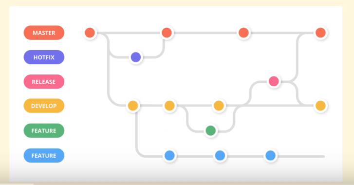

## I. DevOps là gì

### 1. Khái niệm

- Là người thiết kế, tạo ra các quy trình để làm việc giữa team development và team operation. Team app thì viết code để tạo ra app còn team operation sẽ triển khai các app đó lên môi trường production để app hoạt động ổn định.

### 2. Mục đích và hoàn cảnh ra đời:

- DevOps ra đời để giảm khoảng cách giữa 2 team devs và ops, giúp hạn chế số lượng lỗi và tăng chất lượng sản phẩm, VD:

| Trước đây | Bây giờ |
| --------------- | --------------- |
|- Code được triển khai vài lần một tuần trên môi trường Production  |- KS DevOps sẽ triển khai code nhiều lần trong ngày với CI/CD và Infrastructure as code    |
|- Tự tay chạy các câu lệnh cho thao tác lập đi lập lại như đóng gói, triển khai, cài đặt, backup dữ liệu...  |- Tạo ra các luồng CI/CD pipeline để tự động hóa và có thời gian làm việc có giá trị hơn   |

- Sự khác biệt về quan điểm hoạt động giữa Developer và Operators khi chưa có devops:

| Developer | Operator |
| --------------- | --------------- |
|- Làm việc nhanh để tạo chức năng mới   |- Làm việc thận trong, tránh làm hệ thống mất ổn định   |
|- Càng nhanh càng tốt   |- Càng chậm càng chắc   |
|- Cần nhiều thay đổi để sáng tạo    |- Càng ít thay đổi để ổn định   |

--> Dễ xung đột lẫn nhau khi làm việc
--> Devops ra đời để tạo ra một bộ tiêu chuẩn chung, giúp các thành viên của 2 team chia sẻ chung một tầm nhìn, giảm xung đột về lợi ích và kết quả cuối cùng là sản phẩm được bán ra một cách nhanh hơn, ít lỗi hơn, đáp ứng được yêu cầu của khác hàng và tăng tỉ lệ thành công của dự án

### 3. Lợi ích đội devops đem lại:

- Giúp kết nối các team lại với nhau: devops sẽ ngồi với các team để đưa ra quan điểm chung và để nhanh chóng phát hiện vấn đề và xử lý tình huống phát sinh.
- Chia nhỏ để làm giảm rủi ro lớn: các thay đổi lớn trên hệ thống sẽ được chia nhỏ thành nhiều phần, và được lên kế hoạch triển khai theo từng giai đoạn cũng như giám sát liên tục để đảm bảo không có thay đổi nào quá lớn đẩy hệ thống vào tình trạng nguy hiểm.
- Có bộ tiêu chí để đánh giá hiệu quả của hệ thống.

### 4. Công việc chính của một devops:

| STT | Tên công việc |Mô tả|
| --------------- | --------------- |---------------|
| 1   | Thiết kế hệ thống   | Số lượng môi trường, server, BE, FE, Database  |
| 2   | Triển khai code của developer  |Lên các môi trường dev, test, staging, production |
| 3   | Sao lưu, phục hồi dữ liệu   |Của application, database  |
| 4   | Document, đóng gói môi trường template, image,...   |Để dễ dàng tạo nhiều môi trường tương tự nhau  |
| 5   | Migrate data   |Dữ liệu database, application, system  |
| 6   | Update application.   |Cập nhật các phần mềm system hay application  |
| 7   | Performance test   |Đánh giá mức độ hiệu năng của hệ thống  |
| 8   | High availability   |Đánh giá mức độ sẵn sàng của dịch vụ và hệ thống  |
| 9   | Security test   |Đánh giá mức độ bảo mật của hệ thống  |

### 5. Các tools mà một DevOps Engineer cần biết:

#### 5.1. Nhóm công cụ tự động hóa

- Các công cụ lưu trữ mã nguồn: Git, Github/Gitlab, BitBucket
- Các công cụ CI/CD: GitLab CI, Bamboo, Jenkins, CodePipeline (AWS)...
- Infrastructure as Code (IaC): Terraform, Ansible, Chef, Vargant,...
- Nhóm công cụ liên quan đến ảo hóa và triển khai cluster: docker container, k8s
- Giám sát và vận hành hệ thống: ELK, Prometheus, Grafana...

### 5.2. Nhóm công cụ cloud computing:

- AWS (amazon)
- BizFly (của VN): giá rẻ
- Microsoft Azure
- Google Cloud

## II. Roadmap 

1. Git

- Thành thạo Git là hiểu được cách các developer quản lý source code
- Giúp devops có thể phối hợp với developer xử lý bug
- Hiểu được luồng hoạt động của dự án (workflow)

Mỗi nhánh trong Git tương ứng với một môi trường, nhánh Master tương ứng với môi trường Production, nhánh Dev tương ứng vs môi trường phát triển... Mỗi một dự án sẽ có cách chia nhánh khác nhau.

2. Cách đóng gói ứng dụng: 

- Phải hiểu được cách đóng gói các chương trình và triển khai nó trên các môi trường khác nhau
- Xử lý đóng gói nhiều loại ngôn ngữ lập trình, framework

3. Docker

- Cần biết docker images, docker file, docker registry, docker network
- Debug container, tối ưu docker image

4. Linux

5. CI/CD (Jenkins, Gitlab CI)

6. Infrastructure as Code (IaC)

- Sau khi code được đóng gói và test oke thì cần môi trường để chạy thử
- Cần học ansible, terraform, kết hợp cùng các công cụ cloud computing như: AWS, Google cloud, Microsoft Azure

7. Monitoring và Logging:

- ELK, Grafana, Prometheus

8. Clustering

- Để đảm bảo hệ thống luôn ổn định thì phải triển khai hệ thống dưới dạng cluster --> K8S

9. Networking và Security

- Về Networking: hiểu môi hình mạng OSI, giao thức TCP/IP, đấu nối routing các thiết bị trong hệ thống
- Về security: hiểu về mã hóa đối xứng/bất đối xứng, certificate, SSO, mô hình mạng zero trust, hiểu được các phương án chống tấn công mạng.
