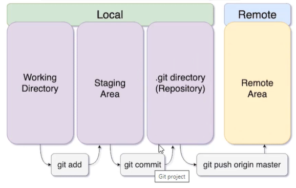

## Các bước upcode dùng git trên command line (áp dụng sau khi cài đặt thành công git trên Windows):

1. Trường hợp chưa khởi tạo repo, chuyển đến thư mục chứa repo trên máy local (tên giống thư mục trên github) và dùng lệnh:

        git init

2. Sau khi thêm file mới hoặc sửa file, dùng lệnh git add để thêm file vào repo:

        git add .

3. Thêm xong thì phải commit thay đổi tới repo:

        git commit -m "Update hello jenkins scripts"

4. Sau khi commit thì push lên repo:

        git push origin main

Tên branch (nhánh) upcode có thể xem trên github để biết thông tin. Mặc định thường là `main` hoặc `master`. Nhập sai tên nhánh khi dùng git push sẽ không upcode lên đc. Dùng `git branch` để biết nhánh đang upcode, kết quả:

5. Nếu muốn sửa tên nhánh đẩy code, dùng lệnh chuyển master thành main:

                git branch -m master main

Chú ý: đảm bảo tên nhánh trong phần config của jenkins item khớp với tên nhánh git 

6. Để biết còn thay đổi nào chưa được commit dùng:

                git status

7. Check link repo đang upcode lên github có đúng như ý:

                git remote -v

- Nếu đang git push mà gặp lỗi như hình dưới:

 thì dùng `git pull` để merge các thay đổi, rồi dùng `git push` để upcode lên github như thường, ngoài ra có thể dùng `git push -f origin main` cũng được mà không cần pull. Nguyên nhân và cách khắc phục lỗi tham khảo trên: https://stackoverflow.com/questions/18328800/updates-were-rejected-because-the-remote-contains-work-that-you-do-not-have-loc
Đại khái là trên repo ở github có chứa file/code/folder mà local repo trên máy tính không có --> cần phải pull về trước.

8. Thêm remote repo: link local repo của máy tính cá nhân với remote repo trên github:

                git remote add origin https://github.com/username/repo-name.git

9. Check xem repo hiện tại có phải repo vừa add:

                git remote -v

10. Clone git repo trên Git về máy cá nhân:

                git clone https://gitlab.com/tuphulam/webhook-2.git

- Nếu trước đấy đã dùng `git clone` để kéo code về thì không cần dùng `git remote add origin` để link local repo với remote repo nữa, tự động link luôn. Dùng `git remote -v` để verify.

--> Để upcode từ máy cá nhân lên gitlab/github, làm các bước sau:
1. clone code về dùng `git clone [repo_url]`. Sau khi clone sẽ không cần dùng `git init` để khởi tạo (chỉ dùng init với thư mục local, chưa link với git)
2. `git remote -v` để verify repo sẽ đẩy code lên.
3. `git branch` để check branch sẽ đẩy code lên (mặc định là master hoặc main)
4. Code xong, dùng `git add .` để chuẩn bị up những thay đổi mới trên local repo hiện tại lên remote repo
5. Comment thay đổi dùng `git commit -m [comment]`. Kết quả sẽ là thông tin các sự thay đổi so với remote repo hiện tại. 
6. Upcode lên dùng `git push` hoặc chi tiết hơn thì dùng `git push origin main`  

- Khác biệt giữa git fetch và git pull:

+ git fetch chỉ kéo sự thay đổi từ remote repo về local repo chứ không thay đổi content trong workspace. Local repo chính là thư mục `.git` ở trong folder project dự án (workspace) 
+ git pull giống git fetch nhưng thêm bước merge, và thay đổi content trong workspace 

### Luồng hoạt động và mô hình của GIT nói chung:

- GIT sẽ có 2 nơi lưu trữ là local và remote.
- Nếu chỉ lưu ở local thì code sẽ mất khi máy local gặp vấn đề.
- Ở local: 
  + working directory là thư mục dự án trên máy local, là nơi ta sẽ code  
  + staging area: là nơi lưu thông tin các file mới thêm/thay đổi sau khi dùng lệnh `git add`. `git add` là lệnh dùng để chuyển trạng thái của file từ `untracked` sang sẵn sàng để commit. Và giúp ta compare trạng thái của file local với file trên remote repo
  + .git directory: sau khi dùng lệnh `git commit` thì mọi sự thay đổi (modifications) và  comment về sự thay đổi (option -m trong lệnh git commit) sẽ được lưu tại thư mục `.git` để sẵn sàng up lên remote repo.
- Ở remote repo: 
  + Ở trạng thái này, code mới đảm bảo không bị mất khi máy local gặp vấn đề, dùng lệnh `git push origin [tên branch]` để upcode lên remote repo

### Nhánh code (branch):

1. Tại sao lại có branch?

- Khi phát triển nhiều chức năng song song, nếu chẳng may 1 tính năng bị lỗi thì ta không muốn tính năng này sẽ ảnh hưởng tới code chính --> Mỗi khi phát triển 1 tính năng ta thường tách riêng ra 1 nhánh và được phát triển độc lập so với nhánh chính --> Khi nào test code oke thì ta sẽ merge code của nhánh đấy vào nhánh chính.  

2. Lệnh `git merge`

- Khi ta phát triển xong tính năng trên 1 nhánh riêng lẻ và muốn merge code vào nhánh chính.

3. Lệnh `git pull`

- Lệnh git pull là kết hợp của lệnh `git fetch` và `git merge`. `git fetch` sẽ kéo các file từ github về máy local còn `git merge` sẽ merge các file này vào working directory của chúng ta.

4. Cách tạo nhánh mới:

- Khi tạo nhánh mới ta có thể code hay làm gì trên nhánh này cũng được mà không ảnh hưởng tới code chính. 
- Lệnh tạo nhánh:

                git checkout -b [tên nhánh]

- Để chuyển đổi qua lại giữa các nhánh:

                git checkout [tên nhánh]

Khi chuyển qua lại thể này thì thư mục project trên máy local sẽ chỉ hiển thị các file của nhánh vừa chuyển, không hiển thị các file của nhánh còn lại.

5. Merge branch:

- Đầu tiên chuyển tới nhánh cần được merge, VD nếu muốn merge nhánh testing vào nhánh main thì phải switch sang nhánh main trước:

                git checkout main

- Sau đó merge nhánh testing vào main dùng lệnh:

                git merge tesing

### Conflict:

- Khi 2 hay 3 người cùng sửa 1 file, VD: người A sửa file test.txt rồi commit lên github, sau đó 5 phút người B cũng sửa file test.txt trên máy local và đẩy lên github --> gây ra lỗi conflict và lúc này github sẽ yêu cầu ta giải quyết conflict xong mới đẩy file được.
- Thông thường, để giải quyết conflict như VD trên, ta phải pull code mới nhất về trước. Tuy nhiên lúc pull code về cũng có thể xảy ra lỗi `Merge conflic` khi pull về. Sửa conflict bằng cách sửa file ở local, xóa những gì mình không muốn up lên github và xóa các ký tự đặc biệt không liên quan đến code ví dụ như: `<<<<>>>>`