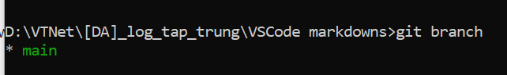
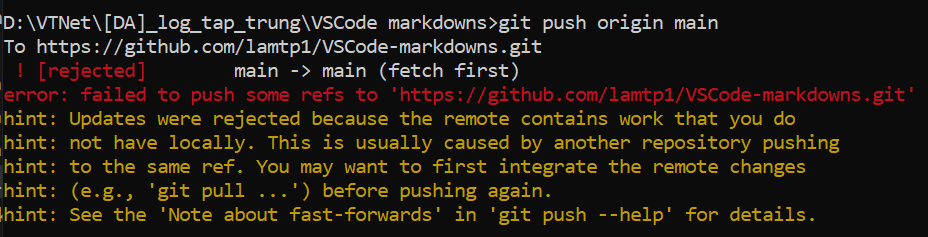

## Các bước upcode dùng git trên command line (áp dụng sau khi cài đặt thành công git trên Windows):

1. Trường hợp chưa khởi tạo repo, chuyển đến thư mục chứa repo trên máy local (tên giống thư mục trên github) và dùng lệnh:

        git init

2. Sau khi thêm file mới hoặc sửa file, dùng lệnh git add để thêm file vào repo:

        git add .

3. Thêm xong thì phải commit thay đổi tới repo:

        git commit -m "Update hello jenkins scripts"

4. Sau khi commit thì push lên repo:

        git push origin main

Tên branch (nhánh) upcode có thể xem trên github để biết thông tin. Mặc định thường là `main` hoặc `master`. Nhập sai tên nhánh khi dùng git push sẽ không upcode lên đc. Dùng `git branch` để biết nhánh đang upcode, kết quả:

5. Nếu muốn sửa tên nhánh đẩy code, dùng lệnh chuyển master thành main:

                git branch -m master main

Chú ý: đảm bảo tên nhánh trong phần config của jenkins item khớp với tên nhánh git 

6. Để biết còn thay đổi nào chưa được commit dùng:

                git status

7. Check link repo đang upcode lên github có đúng như ý:

                git remote -v

- Nếu đang git push mà gặp lỗi như hình dưới:

 thì dùng `git pull` để merge các thay đổi, rồi dùng `git push` để upcode lên github như thường, ngoài ra có thể dùng `git push -f origin main` cũng được mà không cần pull. Nguyên nhân và cách khắc phục lỗi tham khảo trên: https://stackoverflow.com/questions/18328800/updates-were-rejected-because-the-remote-contains-work-that-you-do-not-have-loc
Đại khái là trên repo ở github có chứa file/code/folder mà local repo trên máy tính không có --> cần phải pull về trước.

8. Thêm remote repo: link local repo của máy tính cá nhân với remote repo trên github:

                git remote add origin https://github.com/username/repo-name.git

9. Check xem repo hiện tại có phải repo vừa add:

                git remote -v

10. Clone git repo trên Git về máy cá nhân:

                git clone https://gitlab.com/tuphulam/webhook-2.git

- Nếu trước đấy đã dùng `git clone` để kéo code về thì không cần dùng `git remote add origin` để link local repo với remote repo nữa, tự động link luôn. Dùng `git remote -v` để verify.

--> Để upcode từ máy cá nhân lên gitlab/github, làm các bước sau:
1. clone code về dùng `git clone [repo_url]`. Sau khi clone sẽ không cần dùng `git init` để khởi tạo (chỉ dùng init với thư mục local, không link với git)
2. `git remote -v` để verify repo sẽ đẩy code lên.
3. `git branch` để check branch sẽ đẩy code lên (mặc định là master hoặc main)
4. Code xong, dùng `git add .` để hiện ra thay đổi trong code trước khi up
5. Comment thay đổi dùng `git commit -m [comment]` 
6. Upcode lên dùng `git push` hoặc chi tiết hơn thì dùng `git push origin main`  