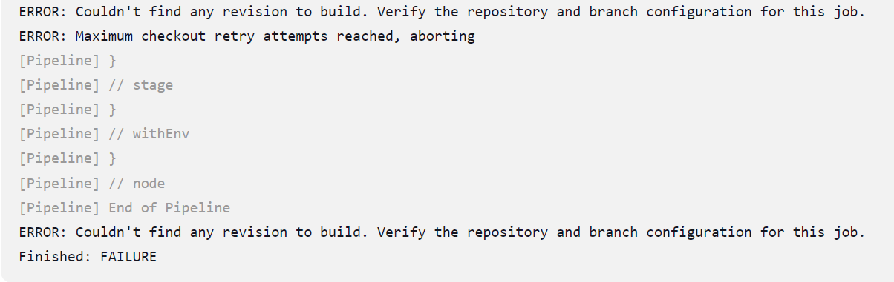
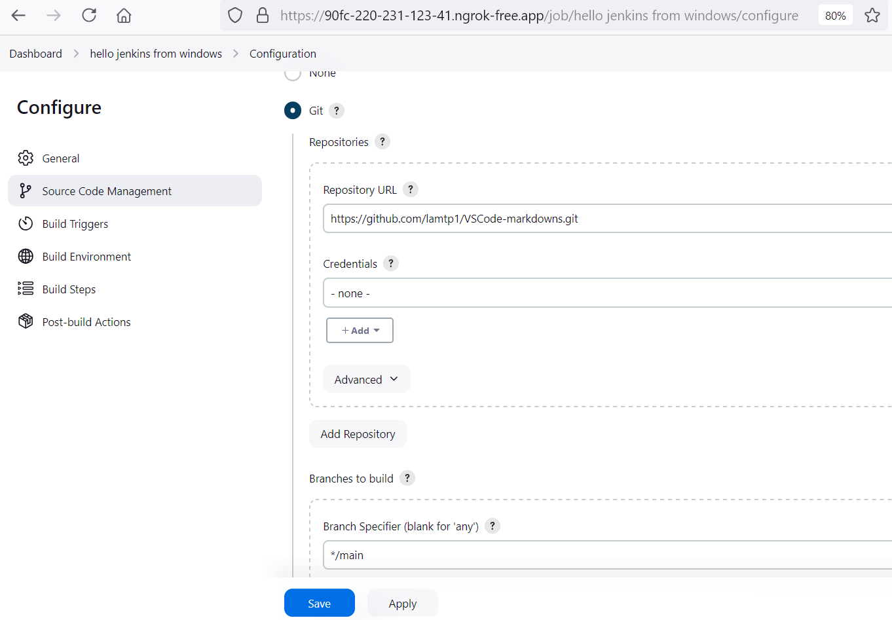
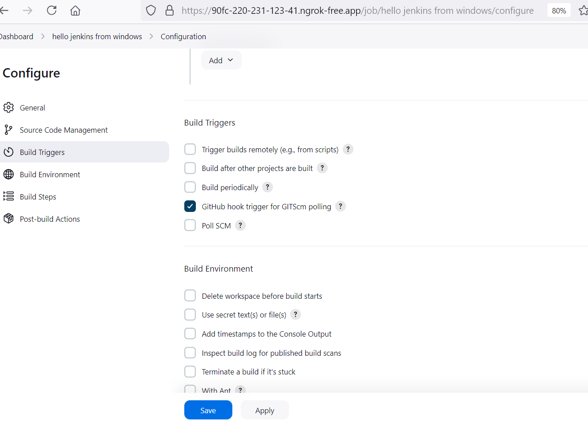
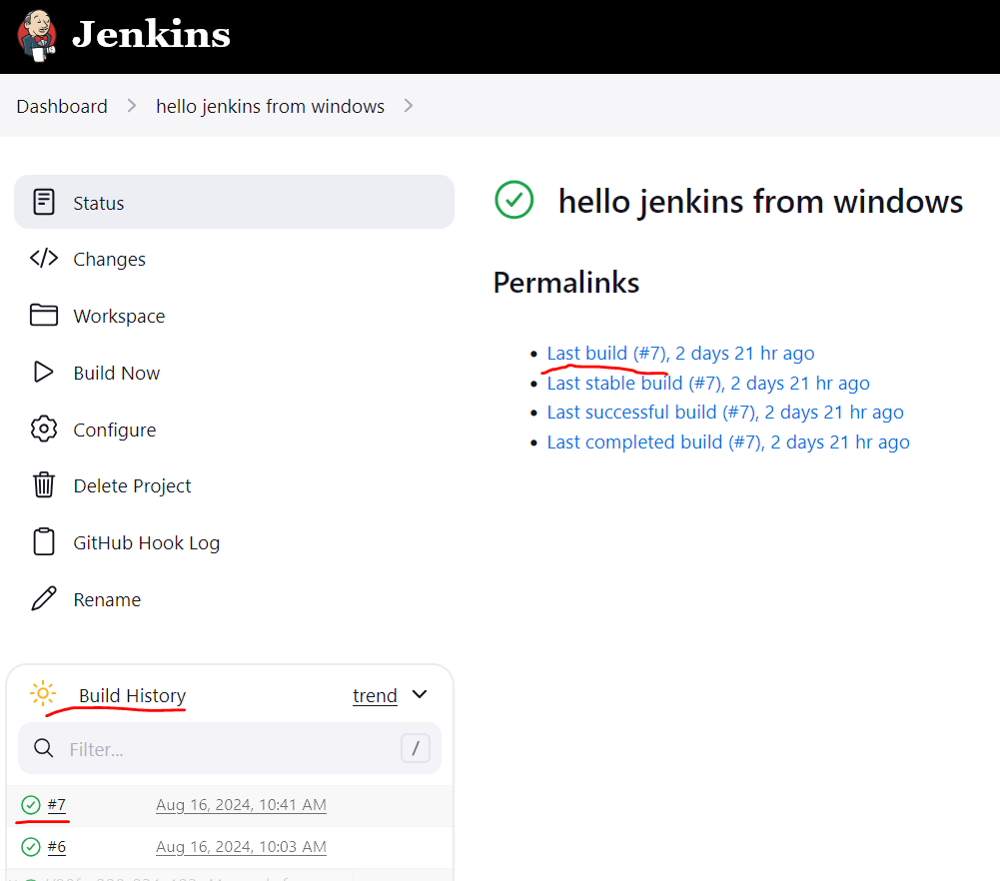
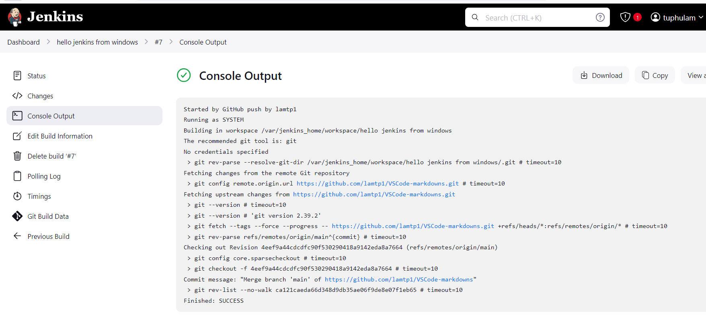
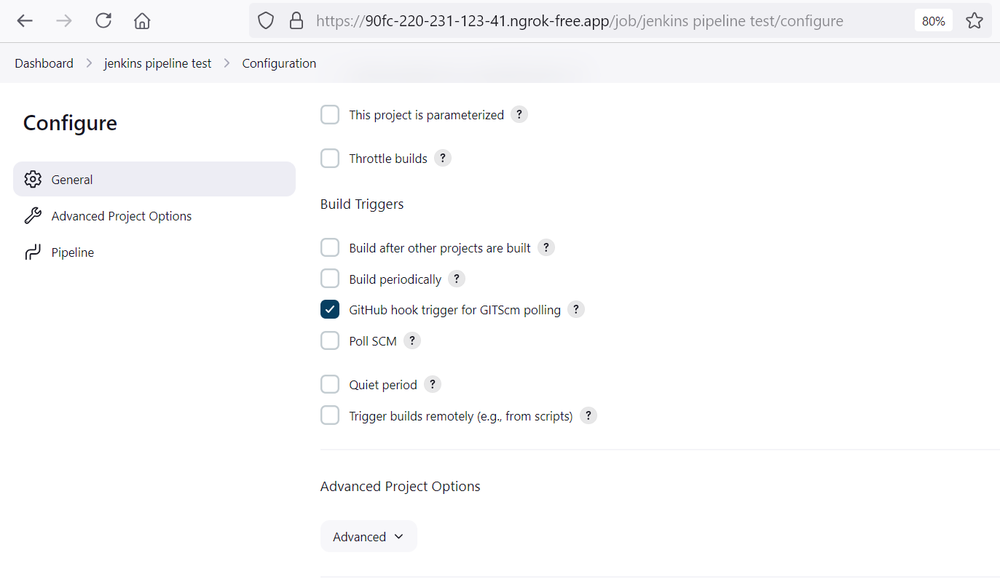
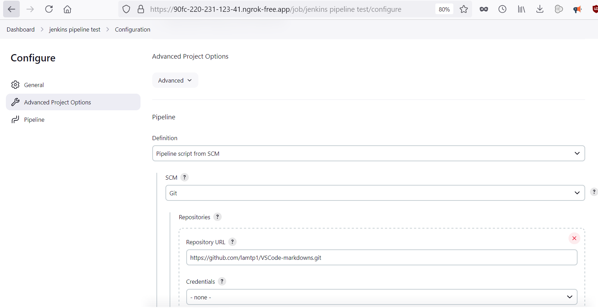
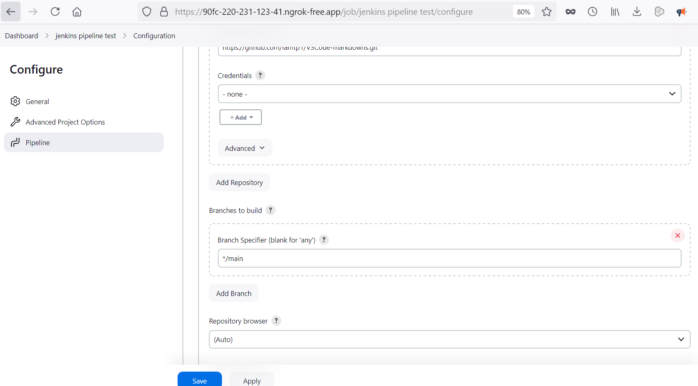
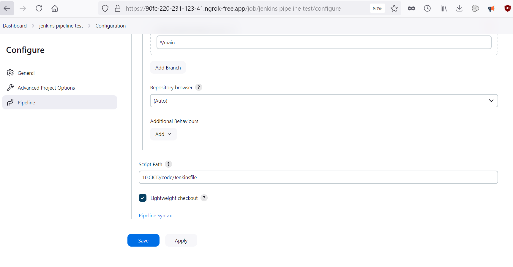
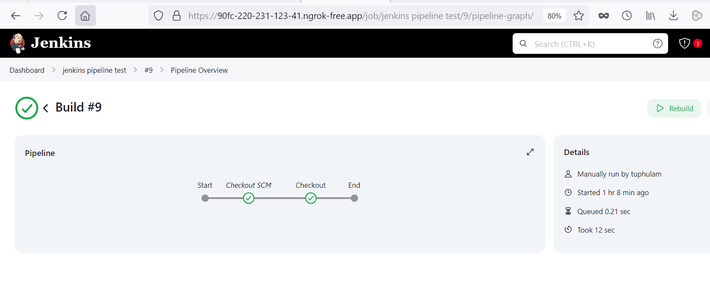

- Để jenkins tự động chạy mỗi khi có code đẩy lên github thì phải chạy manual trước.

- Nếu tên branch không phải `master` thì phải đề cập tên nhánh trong Jenkinsfile (ngoài việc ghi tên branch trong config của project là bắt buộc) nếu không Jenkins pipeline sẽ lỗi như sau:

Ví dụ về Jenkinsfile không lỗi:

        pipeline {
            agent any
            stages {
                stage('Checkout') {
                    steps {
                        git branch: 'main', 
                            url: 'https://github.com/lamtp1/VSCode-markdowns.git'
                    }
                }
            }
        }

Thảm khảo cách fix lỗi ở: https://community.jenkins.io/t/error-couldnt-find-any-revision-to-build/14430/2

### Cách bật hệ thống jenkins test trên LAPTOP

1. Bật Docker desktop, start container jenkins
2. Bật ngrok, gõ `ngrok http 80` để public IP cho jenkins để github có thể bắn notify cho jenkins biết có thay đổi và tự kéo code về build
3. Sử dụng IP mới tạo để vào jenkins.
4. Vào github --> settings --> webhooks, paste ip của jenkins vào payload url và thêm đuôi /github-webhook/ như sau: https://90fc-220-231-123-41.ngrok-free.app/github-webhook/
5. Trên Jenkins, chọn New Item --> Free Style Project/Pipeline. Đối với Free Style project thì cần thêm những mục sau vào phần config:

Chú ý phần nhánh thì chọn nhánh tùy thích, mặc định nếu không điền thì tên nhánh sẽ là `*/master`.
Khi có thay đổi về source trên github (thêm sửa xóa) thì github sẽ bắn notify qua webhook cho jenkins biết và jenkins sẽ tự kéo code mới về (hiện tại trong bài là kéo code về trong container jenkins luôn), kết quả như hình:

- Trong VD này, máy upcode có thể là máy bàn ở nhà --> up lên github --> máy cài Jenkins + ngrok (laptop trên cty) phát hiện thay đổi code trên github --> kéo code về laptop (code kéo về sẽ ở trong container cài jenkins). Yêu cầu là máy cài Jenkins phải bật 24/7 và có kết nối mạng --> nên thay bằng máy ảo của AWS.

Đối với Item là Pipeline thì cần điền những phần sau trong file config:

Phần Script path để path của file Jenkinsfile trên github
Config xong, chọn `Build Now` để test pipeline trước khi chạy tự động, kết quả pipeline:

* Chỉ cần chạy tự động lần đàu tiên với Jenkins Pipeline, lần sau chỉ cần đẩy code lên là Jenkins sẽ tự kéo về.