- File index.html và main.js dùng sử dụng trong suốt quá trình học JS.
- Để sử dụng file index.html và main.js vừa tạo, dùng một cặp thẻ `script` trong phần `body` của file HTML.
- `src=""` nguồn tài nguyên mà ta muốn cung cấp cho  thẻ script --> dùng file main.js vừa tạo.
Để hiện lên header như hình dưới, thì thêm thẻ h1 ở phần body của file html:

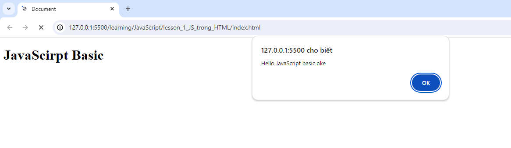

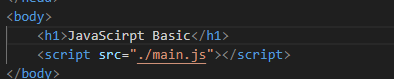

Còn câu `Hello Java...` , là do hàm `alert()` ở main.js. Alert là hàm hiện pop up cảnh báo. Trong một thời điểm, alert chỉ hiện 1 thông báo, nếu có 2 thông báo thì ấn `ok` xong mới hiện thông báo thứ 2.

### Khai báo biến

- dùng `var` để khai báo, theo chuẩn thì nếu biến có 1 từ thì viết thường, 2 từ thì viết thường từ đầu, viết hoa chữ cái đầu của từ thứ 2. VD: hocSinh, sinhVien, xeMay...
- Không có dấu `;` vẫn chạy bình thường nhưng không viết 2 lệnh trên cùng một dòng được.

### Comments:

- Gõ `/**` để VsCode tự gợi ý comment khối code.

### Các hàm built in (được JS xây dựng sẵn), gồm 6 hàm cơ bản hay dùng:

1. Alert
2. Console
3. Confirm
4. Prompt
5. Set timeout
6. Set interval

- Hàm console in ra thông báo trên console của trình duyệt. Console có thể coi là object (đối tượng), dùng dấu `.` sau console để chọn phương thức (method). method log để hiện dòng log, có thể đưa biến vào method log. Ta sẽ dùng console.log là chính để debug.
VD:

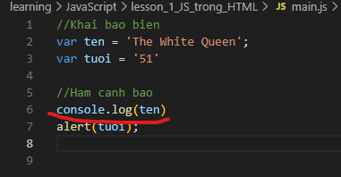

Sẽ hiện ra dòng như dưới
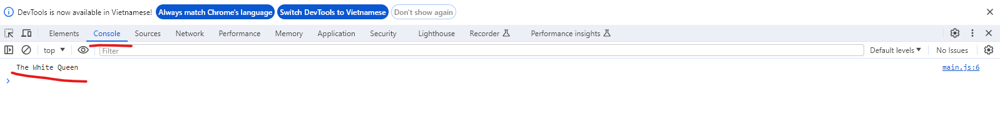

Hoặc nếu để là console.warn thì sẽ có thêm dấu cảnh báo:

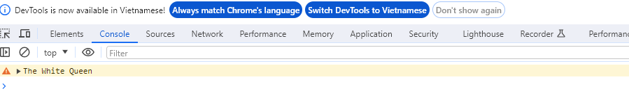

- Hàm `confirm` dùng để xác nhận, VD: xác nhận đủ tuổi trước khi truy cập website, khi dùng sẽ ra hộp thoại pop up.
- Hàm `prompt` dùng để hiện pop up cho phép người dùng nhập từ keyboard. VD nhập tuổi khi bị hỏi ở hàm confirm.
- Hàm `setTimeout`: truyền vào một function cho đoạn code chạy sau một khoảng thời gian, đơn vị ms. Tham số 1 là function, tham số 2 là thời gian.
VD về hàm `setTimeout`:

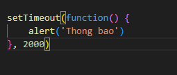

Sau 2s (2000ms) sẽ có thông báo như dưới:

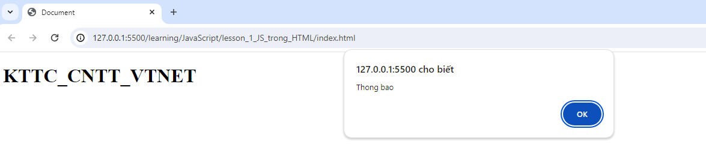

- Hàm `setInterval` khác hàm `setTimeout` ở chỗ cứ sau một khoảng thời gian thì chạy một lần, còn hàm setTimeout chỉ chạy 1 lần:

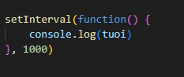

Kết quả sẽ như sau, có 6 dòng `51` ở console log do đã qua 6 giây, log giống nhau sẽ gộp chung 1 dòng:

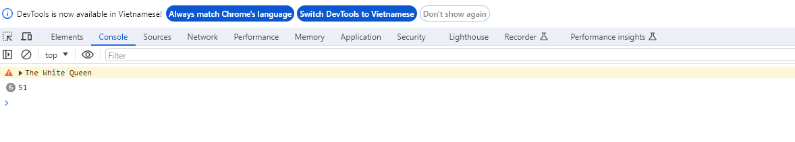

VD về hàm `prompt`:

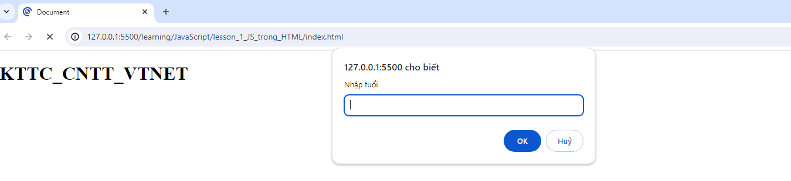

#### `Tóm lại:` 
- Hàm Alert, confirm, prompt đều là hàm hiện của sổ pop up, hàm prompt là kết hợp của alert và confirm nhưng thêm chỗ để nhập thông tin.
- setTimeout chạy 1 đoạn code sau 1 khoảng thời gian và chạy 1 lần.
- setInterval cũng tương tự nhưng chạy nhiều lần.

### Toán tử trong JavaScript:

- Toán tử số học: +, -, *, /
- Toán tử gán: dấu `=`
- Toán từ so sánh: >=. <=, ==
- Toán từ logic: &&, ||...

### Toán tử ++ -- với tiền tố và hậu tố

- TH1: `a++`

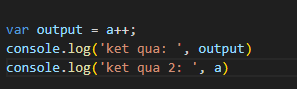

Kết quả như dưới:

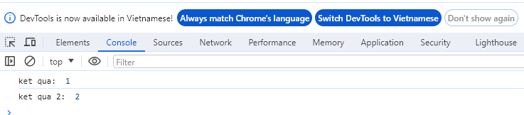

+ B1:  a copy = 1
+ B2: cộng 1 của a, a = a + 1 --> a = 2
+ B3: Trả về biến a copy (=1)

- TH2: `++a`

Kết quả đều bằng 2.
+ B1: +1 cho a, a = a + 1 --> a = 2.
+ B2: Trả về a sau khi được cộng 1 (a = 2).

### If-else

- Trong JS có 6 kiểu giá trị sau khi convert sang boolean sẽ là `false`, nếu khác 6 giá trị này sẽ là `true`:
1. `0`
2. `false`
3. `''`, `_`, `""`: rỗng
4. `undefined`
5. `NaN`
6. `null`

### Kiểu dữ liệu 

1. Dữ liệu nguyên thủy - primitive data
- Number
- String
- Boolean
- Undefined
- Null
- Symbol

là kiểu dữ liệu được tạo ra lưu vào vùng nhớ và không thể sửa được giá trị trong vùng nhớ
VD: var a = 1 thì 1 sẽ được gán vào vùng nhớ x trên RAM và không thể sửa 1 bằng giá trị khác, nếu khai var a = 2 thì một vùng nhớ mới được tạo ra, giá trị 1 ở vùng nhớ cũ vẫn không đổi.

2. Dữ liệu phức tạp - Complex data
- Function
- Object

Chứa nhiều phương thức và thuộc tính hơn kiểu dữ liệu nguyên thủy. 
Object có 2 khái niệm là array và object.

Kiểu dữ liệu object dùng nhiều để lưu các dạng dữ liệu mà ta tương tác trung jv (giống connstruct trong C++)